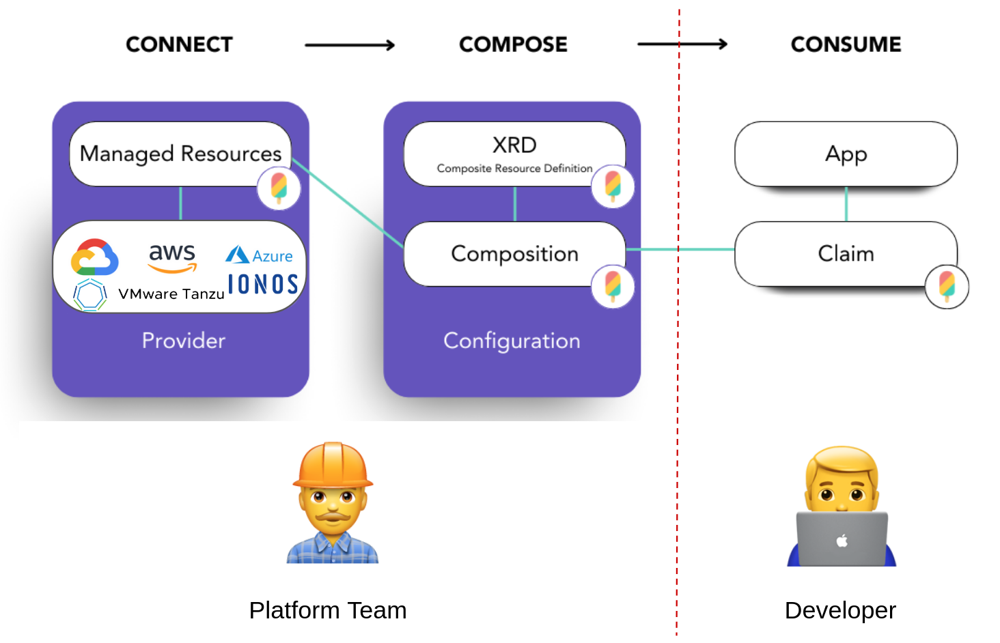

 [🔼 training overview](README.md)

# 1. Crossplane intro & basic concepts

## 1.1 Crossplane concepts: Managed Resources, Providers & Families, Configuration Packages

Crossplane [crossplane.io](https://crossplane.io) claims to be the "The cloud native control plane framework". It introduces a new way how to manage any cloud resource (beeing it Kubernetes-native or not). It's an alternative Infrastructure-as-Code tooling to Terraform, AWS CDK/Bicep or Pulumi and introduces a higher level of abstraction - based on Kubernetes CRDs. 

> 📝 There's [a Google Presentation with more info on Crossplane](https://docs.google.com/presentation/d/1lWuUnMSUPV10ZYdb_vxfuWNwbFXesUt57CgG9PGVHWU/edit?usp=sharing) accompanying this repository 

> 📝 The basic concepts need some time to sink in. All the Crossplane objects play a crucial role and after the training you will definitely know, what they are about. For now this is just an overview. The training dives into each one in detail.

https://docs.crossplane.io/latest/concepts/

* [Managed Resourced (MR)](https://crossplane.io/docs/v1.8/concepts/managed-resources.html): Kubernetes custom resources (CRDs) that represent infrastructure primitives (mostly in cloud providers). All Crossplane Managed Resources could be found via https://doc.crds.dev/ 
* [Composite Resources (XR)](https://crossplane.io/docs/v1.8/concepts/composition.html): compose Managed Resources into higher level infrastructure units (especially interesting for platform teams). They are defined by:
    * a `CompositeResourceDefinition` (XRD) (which defines an OpenAPI schema the `Composition` needs to be conform to)
    * (optional) `CompositeResourceClaims` (XRC) (which is an abstraction of the XR for the application team to consume) - but is fantastic to hold the exact configuration parameters for the concrete resources you want to provision
    * a `Composition` that describes the actual infrastructure primitives aka `Managed Resources` used to build the Composite Resource. One XRD could have multiple Compositions - e.g. to one for every environment like development, stating and production
    * and configured by a `Configuration`
* [Packages](https://docs.crossplane.io/latest/concepts/packages/#install-a-configuration): OCI container images to handle distribution, version updates, dependency management & permissions for Providers & Configurations. Packages were formerly named `Stacks`.
    * [Providers](https://docs.crossplane.io/latest/concepts/providers/): are Packages that bundle a set of Managed Resources & __a Controller to provision infrastructure resources__ - all providers can be found on GitHub, e.g. [provider-aws-s3](https://github.com/crossplane-contrib/provider-upjet-aws) or the [Upbound Marketplace](https://marketplace.upbound.io/providers).
    * [Configuration](https://docs.crossplane.io/latest/concepts/packages/#install-a-configuration): define your own Composite Resources (XRs) & package (now they are a Package) - and push them to an OCI registry via `kubectl crossplane push configuration`. With this Configurations can also be easily installed into other Crossplane clusters.

## 1.2 Crossplane & Platform Engineering

Put into other words and horizontal alignment Crossplane enables Platform Engineering through the introduction of XRDs, Compositions and Claims:

We'll dive into all those concept in the next sections.