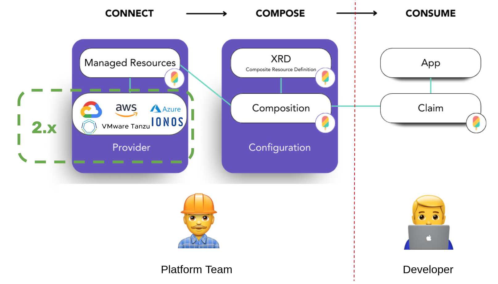

 [🔼 training overview](README.md)

# 2. Install & configure Crossplane & Providers

The initial steps with Crossplane involve getting familiar with installation & Provider configuration.



## 2.1 Install Crossplane

### 2.1.1 Plain via Helm

The Crossplane docs [tell us to use Helm for installation](https://docs.crossplane.io/latest/software/install/):

```shell
helm repo add crossplane-stable https://charts.crossplane.io/stable
helm repo update

helm upgrade --install crossplane --namespace crossplane-system --create-namespace crossplane-stable/crossplane
```

> 📝 Using the appended `--create-namespace`, we don't need to explicitely create the namespace before running `helm upgrade`.


### 2.1.2 Renovate-powered installation via local Helm Chart

As an Renovate-powered alternative we can [create our own simple [Chart.yaml](crossplane-install/Chart.yaml) to enable automatic updates](https://stackoverflow.com/a/71765472/4964553) of our installation if new crossplane versions get released:

```yaml
apiVersion: v2
type: application
name: crossplane
version: 0.0.0 # unused
appVersion: 0.0.0 # unused
dependencies:
  - name: crossplane
    repository: https://charts.crossplane.io/stable
    version: 1.15.1
```

To install Crossplane using our own `Chart.yaml` simply run:

```shell
helm dependency update crossplane-install
helm upgrade --install crossplane --namespace crossplane-system crossplane-install --create-namespace
```

> 📝 Be sure to exclude `charts` and `Chart.lock` files via [.gitignore](.gitignore):

```shell
# Exclude Helm charts lock and packages
**/**/charts
**/**/Chart.lock
```


### 2.1.3 Check Crossplane installation

Check Crossplane version installed with `helm list -n crossplane-system` :

```shell
$ helm list -n crossplane-system
NAME      	NAMESPACE        	REVISION	UPDATED                              	STATUS  	CHART           	APP VERSION
crossplane	crossplane-system	1       	2022-06-21 09:28:21.178357 +0200 CEST	deployed	crossplane-1.8.1	1.8.1
```

Before we can actually apply a Provider we have to make sure that crossplane is actually healthy and running. Therefore we can use the `kubectl wait` command like this:

```shell
kubectl wait --for=condition=ready pod -l app=crossplane --namespace crossplane-system --timeout=120s
```

Otherwise we will run into errors like this when applying a `Provider`:

```shell
error: resource mapping not found for name: "provider-aws" namespace: "" from "provider-aws.yaml": no matches for kind "Provider" in version "pkg.crossplane.io/v1"
ensure CRDs are installed first
```

Finally check crossplane status with `kubectl get all -n crossplane-system`:

```shell
$ kubectl get all -n crossplane-system
NAME                                           READY   STATUS    RESTARTS   AGE
pod/crossplane-7c88c45998-d26wl                1/1     Running   0          69s
pod/crossplane-rbac-manager-8466dfb7fc-db9rb   1/1     Running   0          69s

NAME                                     TYPE        CLUSTER-IP      EXTERNAL-IP   PORT(S)    AGE
service/crossplane-webhooks              ClusterIP   10.96.160.156   <none>        9443/TCP   4d

NAME                                      READY   UP-TO-DATE   AVAILABLE   AGE
deployment.apps/crossplane                1/1     1            1           69s
deployment.apps/crossplane-rbac-manager   1/1     1            1           69s

NAME                                                 DESIRED   CURRENT   READY   AGE
replicaset.apps/crossplane-7c88c45998                1         1         1       69s
replicaset.apps/crossplane-rbac-manager-8466dfb7fc   1         1         1       69s
```

> 📝 "[The base Crossplane installation consists of two pods](https://docs.crossplane.io/latest/concepts/pods/), the crossplane pod and the crossplane-rbac-manager pod. Before starting the core Crossplane container an init container runs. The init container installs the core Crossplane Custom Resource Definitions (CRDs), configures Crossplane webhooks and installs any supplied Providers or Configurations."

Now we should be able to find some new Kubernetes API objects:

```shell
$ kubectl api-resources  | grep crossplane
compositeresourcedefinitions               xrd,xrds     apiextensions.crossplane.io/v1         false        CompositeResourceDefinition
compositionrevisions                       comprev      apiextensions.crossplane.io/v1         false        CompositionRevision
compositions                               comp         apiextensions.crossplane.io/v1         false        Composition
environmentconfigs                         envcfg       apiextensions.crossplane.io/v1alpha1   false        EnvironmentConfig
usages                                                  apiextensions.crossplane.io/v1alpha1   false        Usage
configurationrevisions                                  pkg.crossplane.io/v1                   false        ConfigurationRevision
configurations                                          pkg.crossplane.io/v1                   false        Configuration
controllerconfigs                                       pkg.crossplane.io/v1alpha1             false        ControllerConfig
deploymentruntimeconfigs                                pkg.crossplane.io/v1beta1              false        DeploymentRuntimeConfig
functionrevisions                                       pkg.crossplane.io/v1beta1              false        FunctionRevision
functions                                               pkg.crossplane.io/v1beta1              false        Function
locks                                                   pkg.crossplane.io/v1beta1              false        Lock
providerrevisions                                       pkg.crossplane.io/v1                   false        ProviderRevision
providers                                               pkg.crossplane.io/v1                   false        Provider
storeconfigs                                            secrets.crossplane.io/v1alpha1         false        StoreConfig
```


> 👥 Discussion installation Crossplane (Helm, local Chart, ArgoCD,...)


## 2.2 Install & configure a Crossplane Provider (AWS)

In order to [install & configure the AWS Provider](https://docs.crossplane.io/latest/getting-started/provider-aws/) there are these steps to take:

1. Choose a Crossplane AWS Provider
2. Using the official Upbound (Upjet generated) AWS Provider
3. Create aws-creds.conf file
4. Create AWS Provider secret
5. Create ProviderConfig to consume AWS Provider secret


### 2.2.1 Choose a Crossplane Provider for AWS

Currently there are two crossplane providers for AWS:

* https://github.com/crossplane-contrib/provider-aws (legacy now)
* https://github.com/upbound/provider-aws

The first is written "by hand" and supports around 200 Managed Resources and the other is generated using Upjet supporting the full AWS API with 924 Managed Resources. 

The second provider, which is also called the Upbound "official" provider has been donated to the OpenSource community in September 2023 - so there are now 2 OpenSource providers for AWS. 

Which one should you choose? [This issue clarifies it](https://github.com/crossplane-contrib/provider-aws/issues/1954#issuecomment-1862593913):

> 📝 "Upbound (the company behind crossplane) has moved to its own Terraform-based set of providers. This means that https://github.com/crossplane-contrib/provider-aws is now only maintained by community volunteers since there is a number of people out there who are still using it. __It is kind of legacy but it will receive further updates as long as the community is willing to contribute to it.__ 

Until June 2023 the Upbound providers had a problem. As Managed Resources are CRDs, the Upbound provider introduced a problem to most control planes, since Kubernetes wasn't designed for that amount of CRDs. I gave [a talk about crossplane at our local DevOps Meetup](https://www.meetup.com/de-DE/devopsthde/events/293211158/) and already struggled with the Upbound AWS provider.

Therefore in June 2023 the Upjet generated official Upbound provider has been split into Provider Families: https://blog.crossplane.io/crd-scaling-provider-families/ These split up Upbound providers are the way to go if you start using crossplane today:


The [migration guide](https://docs.upbound.io/providers/migration/) also states that the monolithic provider is already deprecated:

> 📝 "Warning: The monolithic AWS provider (upbound/provider-aws) has been deprecated in favor of the AWS provider family. You can read more about the provider families in our blog post and the official documentation for the provider families is here. We will continue support for the monolithic AWS provider until June 12, 2024. https://marketplace.upbound.io/providers/upbound/provider-aws/"

So head over to [the Upbound marketplace](https://marketplace.upbound.io/) and search for your provider familiy. As we want to use AWS S3 for example, here we went with https://marketplace.upbound.io/providers/upbound/provider-aws-s3.


### 2.2.2 Using the Upbound AWS Provider (Family)

https://marketplace.upbound.io/providers/upbound/provider-aws-s3

Now we can install the Upbound AWS Provider. Therefore create a directory `upbound/provider-aws/provider` directory with a file `upbound-provider-aws-s3.yaml`: 

```yaml
apiVersion: pkg.crossplane.io/v1
kind: Provider
metadata:
  name: upbound-provider-aws-s3
spec:
  package: xpkg.upbound.io/upbound/provider-aws-s3:v1.2.1
  packagePullPolicy: IfNotPresent # Only download the package if it isn’t in the cache.
  revisionActivationPolicy: Automatic # Otherwise our Provider never gets activate & healthy
  revisionHistoryLimit: 1
```

Install it via `kubectl`:


```shell
kubectl apply -f upbound/provider-aws/provider/provider-aws-s3.yaml
```

> 📝 The `package` version in combination with the `packagePullPolicy` configuration here is crucial, since we can configure an update strategy for the Provider here. ~~I'am not sure, if the Crossplane team will provide an installation method where we can use tools like Renovate to keep our Crossplane providers up to date~~ (now Renovate supports Crossplane, see paragraph [Provider & Configuration Package Upgrades with Renovate](https://github.com/jonashackt/crossplane-training/blob/main/08-additional-topics.md#82-provider--configuration-package-upgrades-with-renovate)). We can also let crossplane itself manage new versions for us. But then we sadly leave the GitOps way...

> 📝 Multiple Provider Package revisions can also be installed at the same time (especially when using `packagePullPolicy: Always`). If you installed multiple package versions, you'll see them as `providerrevision.pkg.x` when running `kubectl get crossplane`:

```shell
$ kubectl get crossplane
...
NAME                                                                             HEALTHY   REVISION   IMAGE                                                   STATE      DEP-FOUND   DEP-INSTALLED   AGE
providerrevision.pkg.crossplane.io/upbound-provider-aws-s3-4c95b368de88          True      1          xpkg.upbound.io/upbound/provider-aws-s3:v1.2.1          Active     1           1               3d23h
providerrevision.pkg.crossplane.io/upbound-provider-aws-s3-d6a6663caff3          True      1          xpkg.upbound.io/upbound/provider-aws-s3:v1.1.0          Inactive   1           1               5d22h
...
```

As our first Crossplane Provider has been installed. We need to wait for the Provider to become healthy:

```shell
kubectl wait "providers.pkg.crossplane.io/upbound-provider-aws-s3" --for=condition=Healthy --timeout=180s
```

Obtain the status via `kubectl get provider.pkg.crossplane.io`:

```shell
$ kubectl get provider.pkg.crossplane.io
NAME                          INSTALLED   HEALTHY   PACKAGE                                               AGE
upbound-provider-aws-s3       True        True      xpkg.upbound.io/upbound/provider-aws-s3:v0.46.0       113s
upbound-provider-family-aws   True        True      xpkg.upbound.io/upbound/provider-family-aws:v0.46.0   108s
```

Otherwise we may run into errors like this when applying the `ProviderConfig` right after the Provider.


To display all the Managed Resources the Provider installed, run:

```shell
k get crds | grep s3
```


### 2.2.3 Create aws-creds.conf file

With this prepared [we can create an `aws-creds.conf` file](https://docs.crossplane.io/latest/getting-started/provider-aws/#generate-an-aws-key-pair-file):

```shell
echo "[default]
aws_access_key_id = $(aws configure get aws_access_key_id)
aws_secret_access_key = $(aws configure get aws_secret_access_key)
" > aws-creds.conf
```

> 📝 Don't ever check this file into source control - it holds your AWS credentials! Add it to your [.gitignore](.gitignore) file right now:

```shell
# Exclude credential configuration files like aws-creds.conf
*-creds.conf
```


### 2.2.4 Create AWS Provider secret

Now we need to use the `aws-creds.conf` file to create the Crossplane AWS Provider secret:

```shell
kubectl create secret generic aws-creds -n crossplane-system --from-file=creds=./aws-creds.conf
```

If everything went well there should be a new `aws-creds` Secret ready:


### 2.2.5 Create ProviderConfig to consume AWS Provider secret

To get our Provider working we also need to create a matching `ProviderConfig` that will tell the Provider where to find it's AWS credentials. Therefore we create a new directory `upbound/provider-aws/config` with a new file `provider-config-aws.yaml` inside:

```yaml
apiVersion: aws.upbound.io/v1beta1
kind: ProviderConfig
metadata:
  name: default
spec:
  credentials:
    source: Secret
    secretRef:
      namespace: crossplane-system
      name: aws-creds
      key: creds
```

> 📝 Crossplane resources use the `ProviderConfig` named `default` if no specific ProviderConfig is specified, so this ProviderConfig will be the default for all AWS resources.

The `secretRef.name` and `secretRef.key` has to match the fields of the already created Secret.

Apply it via `kubectl`:


```shell
kubectl apply -f upbound/provider-aws/config/provider-config-aws.yaml
```

Now we should have everything in place to use the Upbound AWS Provider! We can double check via `kubectl get crossplane`:

```shell
$ kubectl get crossplane
NAME                                    AGE
providerconfig.aws.upbound.io/default   55s

NAME                                                                             HEALTHY   REVISION   IMAGE                                                   STATE      DEP-FOUND   DEP-INSTALLED   AGE
providerrevision.pkg.crossplane.io/upbound-provider-aws-s3-4c95b368de88          True      1          xpkg.upbound.io/upbound/provider-aws-s3:v1.2.1          Active     1           1               3d23h

NAME                                                        INSTALLED   HEALTHY   PACKAGE                                                 AGE
provider.pkg.crossplane.io/upbound-provider-aws-s3          True        True      xpkg.upbound.io/upbound/provider-aws-s3:v1.2.1          3d23h

NAME                                        AGE   TYPE         DEFAULT-SCOPE
storeconfig.secrets.crossplane.io/default   4d    Kubernetes   crossplane-system
```


Now we should have some more Kubernetes API resources available:

```shell
$ kubectl api-resources | grep aws
providerconfigs                                         aws.upbound.io/v1beta1                 false        ProviderConfig
providerconfigusages                                    aws.upbound.io/v1beta1                 false        ProviderConfigUsage
storeconfigs                                            aws.upbound.io/v1alpha1                false        StoreConfig
bucketaccelerateconfigurations                          s3.aws.upbound.io/v1beta1              false        BucketAccelerateConfiguration
bucketacls                                              s3.aws.upbound.io/v1beta1              false        BucketACL
bucketanalyticsconfigurations                           s3.aws.upbound.io/v1beta1              false        BucketAnalyticsConfiguration
bucketcorsconfigurations                                s3.aws.upbound.io/v1beta1              false        BucketCorsConfiguration
bucketintelligenttieringconfigurations                  s3.aws.upbound.io/v1beta1              false        BucketIntelligentTieringConfiguration
bucketinventories                                       s3.aws.upbound.io/v1beta1              false        BucketInventory
bucketlifecycleconfigurations                           s3.aws.upbound.io/v1beta1              false        BucketLifecycleConfiguration
bucketloggings                                          s3.aws.upbound.io/v1beta1              false        BucketLogging
bucketmetrics                                           s3.aws.upbound.io/v1beta1              false        BucketMetric
bucketnotifications                                     s3.aws.upbound.io/v1beta1              false        BucketNotification
bucketobjectlockconfigurations                          s3.aws.upbound.io/v1beta1              false        BucketObjectLockConfiguration
bucketobjects                                           s3.aws.upbound.io/v1beta1              false        BucketObject
bucketownershipcontrols                                 s3.aws.upbound.io/v1beta1              false        BucketOwnershipControls
bucketpolicies                                          s3.aws.upbound.io/v1beta1              false        BucketPolicy
bucketpublicaccessblocks                                s3.aws.upbound.io/v1beta1              false        BucketPublicAccessBlock
bucketreplicationconfigurations                         s3.aws.upbound.io/v1beta1              false        BucketReplicationConfiguration
bucketrequestpaymentconfigurations                      s3.aws.upbound.io/v1beta1              false        BucketRequestPaymentConfiguration
buckets                                                 s3.aws.upbound.io/v1beta1              false        Bucket
bucketserversideencryptionconfigurations                s3.aws.upbound.io/v1beta1              false        BucketServerSideEncryptionConfiguration
bucketversionings                                       s3.aws.upbound.io/v1beta1              false        BucketVersioning
bucketwebsiteconfigurations                             s3.aws.upbound.io/v1beta1              false        BucketWebsiteConfiguration
objectcopies                                            s3.aws.upbound.io/v1beta1              false        ObjectCopy
objects                                                 s3.aws.upbound.io/v1beta1              false        Object
```


> 👥 Discussion differences to Azure etc.