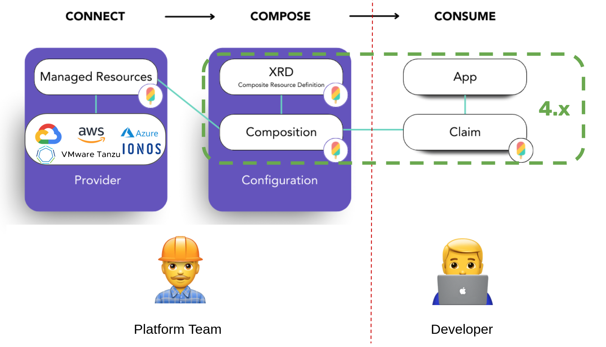
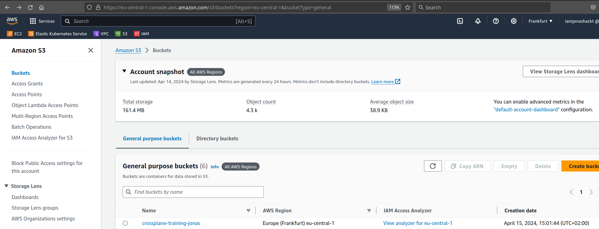
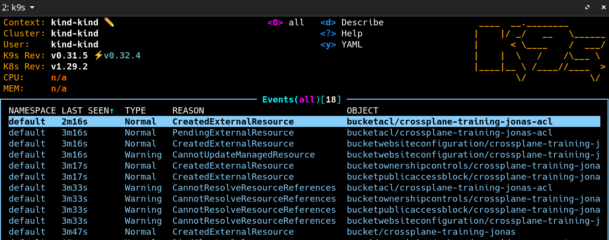
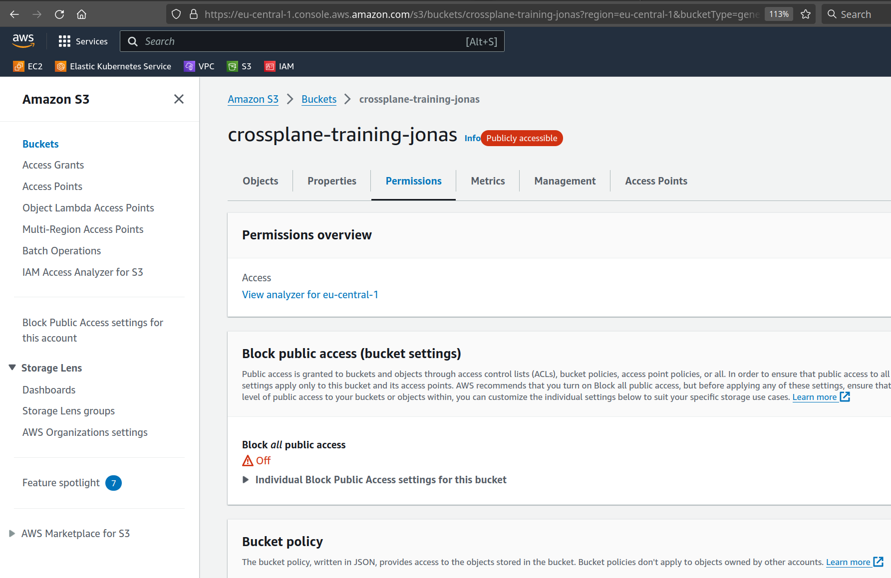

 [🔼 training overview](README.md)

# 4. Compositions, XRDs & Claims

Training about Compositions, XRDs, XRs & Claims (XRCs)



## 4.1 CompositeResourceDefinitions (or XRDs)

https://docs.crossplane.io/latest/concepts/composite-resource-definitions/

> 📝 A CompositeResourceDefinition (or XRD) defines the type and schema of your XR. It lets Crossplane know that you want a particular kind of XR to exist, and what fields that XR should have.

Since defining your own CompositeResourceDefinitions and Compositions is the main work todo with Crossplane, it's always good to know the full Reference documentation which can be found here https://docs.crossplane.io/latest/concepts/compositions/

> 📝 All possible fields an XRD can have [are documented in the docs](https://docs.crossplane.io/latest/concepts/composite-resource-definitions/). 

The field `spec.versions.schema` must contain a OpenAPI schema, which is similar to the ones used by any Kubernetes CRDs. They determine what fields the XR (and Claim) will have. The full CRD documentation and a guide on how to write OpenAPI schemas [could be found in the Kubernetes docs](https://kubernetes.io/docs/tasks/extend-kubernetes/custom-resources/custom-resource-definitions/).


### 4.1.1 Scaffold a Composite Resource Definition (XRD)

When [starting to create a XRD](https://docs.upbound.io/xp-arch-framework/building-apis/building-apis-xrds/#authoring-an-xrd) you may want to start with this scaffold:

> The official Scaffold is somehow wrong right now. Use `metadata.name` `x-<plural-name>.<group>` instead of `<plural-name>.<group>` and also use lower `x` instead of `X`.

```yaml
apiVersion: apiextensions.crossplane.io/v1
kind: CompositeResourceDefinition
metadata:
  name: x-<plural-name>.<group>
spec:
  group: <group.example.com>
  names:
    kind: x-<kind-name>
    plural: x-<kind-name-plural>
  claimNames:
    kind: <kind-name>
    plural: <kind-name-plural>
  versions:
  - name: v1alpha1
    served: true
    referenceable: true
    schema:
      openAPIV3Schema:
        type: object
        properties:
          spec:
            type: object
            properties:
              parameters:
                type: object
                properties:
                  <to-do>
            required:
            - parameters
          status:
            type: object
            properties:
                <todo>
```

> 📝 The presence of the `spec.claimNames` makes this XRD claimable. If you don't want this Composite Resource to become claimable omit this field.

> Crossplane composite resources are cluster-scoped objects, which means they’re not associated with any given namespace in your control plane. By making a composite resource claimable, this enables you to restrict users to different namespaces in your control plane and thereby improve isolation between them.

Note that Crossplane will be automatically extended this section. Therefore the following fields are used by Crossplane and will be ignored if they're found in the schema:

    spec.resourceRef
    spec.resourceRefs
    spec.claimRef
    spec.writeConnectionSecretToRef
    status.conditions
    status.connectionDetails


### 4.1.2 Craft your XRD `objectstorage` for a AWS S3 Bucket

Now create a new directory `apis/s3` with a new file `definition.yaml` and copy the contents of the scaffold yaml block above. Try to insert all the needed configuration yourself.

For the `group` field use a unique domain name you or your company owns - like `crossplane.jonashackt.io`.

Define 2 parameters that need to be defined by an XR/Claim: `bucketName` and `region`.

> Have a look at the [XRD creation best practices](https://docs.upbound.io/xp-arch-framework/building-apis/building-apis-xrds/#authoring-best-practices) and [OpenAPI data types](https://swagger.io/docs/specification/data-models/data-types/)

If you're finished, install the XRD into our cluster with:

```shell
kubectl apply -f apis/s3/definition.yaml
```

Now the XRD should be installed:

```shell
kubectl get compositeresourcedefinition
NAME                                       ESTABLISHED   OFFERED   AGE
xobjectstorages.crossplane.jonashackt.io   True          True      4d2h
```

We can double check the CRDs beeing created with `kubectl get crds` and filter them using `grep` to our group name `crossplane.jonashackt.io`:

```shell
$ kubectl get crds | grep crossplane.jonashackt.io
objectstorages.crossplane.jonashackt.io                         2022-06-27T09:54:18Z
xobjectstorages.crossplane.jonashackt.io                        2022-06-27T09:54:18Z
```

> 💡 Only, if you're really stuck or don't know what to do, here's a working solution:

<details>
  <summary>🚀 Expand to see a working solution</summary>

[`apis/s3/definition.yaml`](apis/s3/definition.yaml):

```yaml
apiVersion: apiextensions.crossplane.io/v1
kind: CompositeResourceDefinition
metadata:
  # XRDs must be named 'x<plural>.<group>'
  name: xobjectstorages.crossplane.jonashackt.io
spec:
  # This XRD defines an XR in the 'crossplane.jonashackt.io' API group.
  # The XR or Claim must use this group together with the spec.versions[0].name as it's apiVersion, like this:
  # 'crossplane.jonashackt.io/v1alpha1'
  group: crossplane.jonashackt.io
  
  # XR names should always be prefixed with an 'X'
  names:
    kind: XObjectStorage
    plural: xobjectstorages
  # This type of XR offers a claim, which should have the same name without the 'X' prefix
  claimNames:
    kind: ObjectStorage
    plural: objectstorages
  
  # default Composition when none is specified (must match metadata.name of a provided Composition)
  # e.g. in composition.yaml
  defaultCompositionRef:
    name: objectstorage-composition

  versions:
  # This version should only change, when the parameters defined also change - and thus create a new version
  - name: v1alpha1
    served: true
    referenceable: true
    # OpenAPI schema (like the one used by Kubernetes CRDs). Determines what fields
    # the XR (and claim) will have. Will be automatically extended by crossplane.
    # See https://kubernetes.io/docs/tasks/extend-kubernetes/custom-resources/custom-resource-definitions/
    # for full CRD documentation and guide on how to write OpenAPI schemas
    schema:
      openAPIV3Schema:
        type: object
        properties:
          spec:
            type: object
            # We define 2 needed parameters here one has to provide as XR or Claim spec.parameters
            properties:
              parameters:
                type: object
                properties:
                  bucketName:
                    type: string
                  region:
                    type: string
                required:
                  - bucketName
                  - region
```
</details>


### 4.1.3 XRD Versioning

You may already asked yourself about the version used in the OpenAPI schema.[ The docs nail it](https://docs.upbound.io/xp-arch-framework/building-apis/building-apis-xrds/#versioning):

> Over the lifetime of your custom API, there is a chance the shape of the API could change and you could introduce breaking changes.

> 📝 Notice the versions field is an array, so you can declare multiple versions of your API definition in the XRD. __Crossplane doesn’t allow serving multiple versions.__ Meaning, once v1alpha2 goes live, all the composites are force-migrated to that version

A version change in the XRD (such as going from v1alpha1 -> v1alpha2) requires a new composition that implements the new version. To do this, [you need to define a new composition object](https://docs.upbound.io/xp-arch-framework/building-apis/building-apis-compositions/#composition-versioning), and point the compositionTypeRef to the new API version. We'll see how to create Compositions in the next section.


## 4.2 Build your first Composition

https://docs.crossplane.io/latest/concepts/compositions/

The main work in Crossplane has to be done crafting the Compositions. This is because they interact with the infrastructure primitives the cloud provider APIs provide.

Now create a new file `composition.yaml` inside `apis/s3` and copy the contents of the following [scaffold (from the upbound docs)](https://docs.upbound.io/xp-arch-framework/building-apis/building-apis-compositions/#scaffolding-a-composition):

```yaml
apiVersion: apiextensions.crossplane.io/v1
kind: Composition
metadata:
  name: <plural-name>.<group>
spec:
  writeConnectionSecretsToNamespace: crossplane-system
  compositeTypeRef:
    apiVersion: <group.example.com>/v1alpha1
    kind: X<KindName>
  resources:
    - name: <name>
      base:
        apiVersion: <resource-version>
        kind: <resource-kind>
        spec:
          forProvider:
            ...
      patches:
        ...
```

> 📝 Use the Provider documentation from the Upbound Marketplace and search for the Managed Resource you want to use. As we're using the `provider-aws-s3` [head over to it's Provider docs](https://marketplace.upbound.io/providers/upbound/provider-aws-s3) and search for the `Bucket` resource.

In the `patches` section use the following configuration to fill the fields we already defined in the XRD into the `Bucket` resource fields.

```yaml
      patches:
        - fromFieldPath: "spec.parameters.bucketName"
          toFieldPath: "metadata.name"
        - fromFieldPath: "spec.parameters.region"
          toFieldPath: "spec.forProvider.region"
```

Apply the Composition via:

```shell
kubectl apply -f apis/s3/composition.yaml
```

Have a look at your installed Composition via:

```shell
kubectl get composition
NAME                        XR-KIND          XR-APIVERSION                       AGE
objectstorage-composition   XObjectStorage   crossplane.jonashackt.io/v1alpha1   1m2s
```

Also have a look at the available revisions of your Compositions via `kubectl get compositionrevision`:

```shell
kubectl get compositionrevision
NAME                                REVISION   XR-KIND          XR-APIVERSION                       AGE
objectstorage-composition-a5bf2cb   1          XObjectStorage   crossplane.jonashackt.io/v1alpha1   1m4s
```

There's only one revision for now. We'll come back here later!

> 💡 Only, if you're really stuck or don't know what to do, here's a working solution:

<details>
  <summary>🚀 Expand to see a working solution</summary>

[`apis/s3/composition.yaml`](apis/s3/composition.yaml):

```yaml
apiVersion: apiextensions.crossplane.io/v1
kind: Composition
metadata:
  name: objectstorage-composition
  labels:
    # An optional convention is to include a label of the XRD. This allows
    # easy discovery of compatible Compositions.
    crossplane.io/xrd: xobjectstorages.crossplane.jonashackt.io
    # The following label marks this Composition for AWS. This label can 
    # be used in 'compositionSelector' in an XR or Claim.
    provider: aws
spec:
  # Each Composition must declare that it is compatible with a particular type
  # of Composite Resource using its 'compositeTypeRef' field. The referenced
  # version must be marked 'referenceable' in the XRD that defines the XR.
  compositeTypeRef:
    apiVersion: crossplane.jonashackt.io/v1alpha1
    kind: XObjectStorage
  
  # When an XR is created in response to a claim Crossplane needs to know where
  # it should create the XR's connection secret. This is configured using the
  # 'writeConnectionSecretsToNamespace' field.
  writeConnectionSecretsToNamespace: crossplane-system
  
  # Each Composition must specify at least one composed resource template.
  resources:
    # Providing a unique name for each entry is good practice.
    # Only identifies the resources entry within the Composition. Required in future crossplane API versions.
    - name: bucket
      base:
        # see https://marketplace.upbound.io/providers/upbound/provider-aws-s3/v1.3.1/resources/s3.aws.upbound.io/Bucket/v1beta1
        apiVersion: s3.aws.upbound.io/v1beta1
        kind: Bucket
        metadata: {}
        spec:
          deletionPolicy: Delete
      
      patches:
        - fromFieldPath: "spec.parameters.bucketName"
          toFieldPath: "metadata.name"
        - fromFieldPath: "spec.parameters.region"
          toFieldPath: "spec.forProvider.region"
```

> 📝 As you can see we now use the Managed Resource `Bucket` inside `spec.resources`. We also use so called `patches` to insert parameters into the Bucket. We'll have a deeper look into these Patches later. For now both should be already known from the Composite Resource Definition.
</details>


## 4.3 Your first Composite Resource (XR) or Claim (XRC) (AWS S3)

Crossplane could look quite intimidating when having a first look. There are few guides around to show how to approach a setup when using Crossplane the first time. You can choose between writing an XR __OR__ XRC! You don't need both, since the XR will be generated from the XRC, if you choose to craft a XRC.

https://docs.crossplane.io/latest/concepts/composite-resources/

Since we want to create a S3 Bucket, we create our first Composite Resource Claim - or simply Claim. Therefore create a new file `objectstorage.yaml` in `infrastructure/s3`:

 here's an suggestion for an [claim.yaml](crossplane-contrib/provider-aws/s3/claim.yaml):

```yaml
# Use the spec.group/spec.versions[0].name defined in the XRD
apiVersion: crossplane.jonashackt.io/v1alpha1
kind: ObjectStorage
metadata:
  # Only claims are namespaced, unlike XRs.
  namespace: default
  name: managed-s3
spec:
  # The compositionRef specifies which Composition this XR will use to compose
  # resources when it is created, updated, or deleted.
  compositionRef:
    name: objectstorage-composition
  
  # Parameters for the Composition to provide the Managed Resources (MR) with
  # to create the actual infrastructure components
  parameters:
    bucketName: crossplane-training-yourNameHere
    region: eu-central-1
```


Apply your first Claim via kubectl:

```shell
kubectl apply -f infrastructure/s3/objectstorage.yaml
```

Again in the AWS console your Bucket should show up:



> Your first Crossplane Composition (incl. it's MRs) should come alive.


> 📝 Also have a look at the Composite Resource (the 'XR'). Crossplane automatically generates the XR based on the Claim! Therefore run:

```shell
kubectl get composite
```


When something goes wrong with the validation while applying your Claim, this could look like this:

```shell
$ kubectl apply -f claim.yaml
error: error validating "claim.yaml": error validating data: [ValidationError(S3Bucket.metadata): unknown field "crossplane.io/external-name" in io.k8s.apimachinery.pkg.apis.meta.v1.ObjectMeta_v2, ValidationError(S3Bucket.spec): unknown field "parameters" in io.jonashackt.crossplane.v1alpha1.S3Bucket.spec, ValidationError(S3Bucket.spec.writeConnectionSecretToRef): missing required field "namespace" in io.jonashackt.crossplane.v1alpha1.S3Bucket.spec.writeConnectionSecretToRef, ValidationError(S3Bucket.spec): missing required field "bucketName" in io.jonashackt.crossplane.v1alpha1.S3Bucket.spec, ValidationError(S3Bucket.spec): missing required field "region" in io.jonashackt.crossplane.v1alpha1.S3Bucket.spec]; if you choose to ignore these errors, turn validation off with --validate=false
```

The Crossplane validation is a great way to debug your yaml configuration - it hints you to the actual problems that are still present.

From Crossplane CLI version 1.5 on there's also the way to pre-validate the Claims and Compositions via the `crossplane beta validate` command. For more info see the next sections.


## 4.4 Validate your Claim against XRDs

[As the docs state](https://docs.crossplane.io/latest/cli/command-reference/#beta-validate):

> The crossplane beta validate command validates compositions against provider or XRD schemas using the Kubernetes API server’s validation library.

So let's grab our Composite Resource Definition and validate our Claim against it:

```shell
crossplane beta validate --cache-dir ~/.crossplane apis/s3/definition.yaml infrastructure/s3/objectstorage.yaml
[✓] crossplane.jonashackt.io/v1alpha1, Kind=ObjectStorage, managed-upbound-s3 validated successfully
Total 1 resources: 0 missing schemas, 1 success cases, 0 failure cases
```

To prevent the command from polluting our projects with `.crossplane` directories, we should also provide a `--cache-dir ~/.crossplane` flag, which will deposit the directory in the user profile folder.


### 4.4.1 Validate a full directory against XRDs or Provider schemes

We can also validate a full directory:

```shell
crossplane beta validate --cache-dir ~/.crossplane apis/s3/definition.yaml upbound/provider-aws/provider
[✓] crossplane.jonashackt.io/v1alpha1, Kind=ObjectStorage, managed-upbound-s3 validated successfully
[!] could not find CRD/XRD for: apiextensions.crossplane.io/v1, Kind=Composition
[!] could not find CRD/XRD for: pkg.crossplane.io/v1, Kind=Provider
[!] could not find CRD/XRD for: aws.upbound.io/v1beta1, Kind=ProviderConfig
[!] could not find CRD/XRD for: apiextensions.crossplane.io/v1, Kind=CompositeResourceDefinition
[✓] s3.aws.upbound.io/v1beta1, Kind=Bucket, crossplane-argocd-s3-bucket validated successfully
[✓] s3.aws.upbound.io/v1beta1, Kind=BucketPublicAccessBlock, crossplane-argocd-s3-bucket-pab validated successfully
[✓] s3.aws.upbound.io/v1beta1, Kind=BucketOwnershipControls, crossplane-argocd-s3-bucket-osc validated successfully
[✓] s3.aws.upbound.io/v1beta1, Kind=BucketACL, crossplane-argocd-s3-bucket-acl validated successfully
[✓] s3.aws.upbound.io/v1beta1, Kind=BucketWebsiteConfiguration, crossplane-argocd-s3-bucket-websiteconf validated successfully
Total 10 resources: 4 missing schemas, 6 success cases, 0 failure cases
```


### 4.4.2 Composition Validation

To be able to validate Compositions & XRs, we need another command in the game: `crossplane beta render`:

https://docs.crossplane.io/latest/cli/command-reference/#validate-render-command-output

> You can pipe the output of `crossplane beta render` into `crossplane beta validate` to validate complete Crossplane resource pipelines, including XRs, compositions and composition functions.

Therefore we need to use the `--include-full-xr` command with `crossplane beta render` and the `-` option with `crossplane beta validate` like that:

```shell
crossplane beta render apis/s3/composition.yaml --include-full-xr | crossplane beta validate upbound/provider-aws/provider/provider-aws-s3.yaml -
```


## 4.5 Compositions using multiple MRs: Patch & Transforms

https://docs.crossplane.io/latest/concepts/compositions/#changing-resource-fields

> 📝 The primary method to change resources is using a resource patch and transform. Patch and transforms allow matching specific input fields, modifying them and applying them to the managed resource.

https://docs.crossplane.io/latest/concepts/patch-and-transform/

> 📝 A Composition patch is the action of changing a field.

> 📝 A Composition transform modifies the values before applying the patch.

Examples of using patch and transforms include:

* changing the name of the external resource
* mapping generic terms like “east” or “west” to specific provider locations
* appending custom labels or strings to resource fields

Additional information awaits in the Upbound docs:

https://docs.upbound.io/xp-arch-framework/building-apis/building-apis-compositions/#composition-best-practices


### 4.5.1 Example Patches & Patch types

We already saw an example Patch in our first Composition:

```yaml
    - name: bucket
      base:
        # see https://marketplace.upbound.io/providers/upbound/provider-aws-s3/v1.3.1/resources/s3.aws.upbound.io/Bucket/v1beta1
        apiVersion: s3.aws.upbound.io/v1beta1
        kind: Bucket
        metadata: {}
        spec:
          deletionPolicy: Delete
      
      patches:
        - fromFieldPath: "spec.parameters.bucketName"
          toFieldPath: "metadata.name"
        - fromFieldPath: "spec.parameters.region"
          toFieldPath: "spec.forProvider.region"
```

The `fromFieldPath` configures Crossplane to use the XR/Claim defined field to map it to the Managed Resource' `toFieldPath`. In this example both parameters are defined in the XRD and the Managed Resources fields are defined by the AWS S3 Provider.

There's an implicit Patch `type` field. We can use it explicitely with a Range of Patches. The Patch type `FromCompositeFieldPath` takes a value in a XR/Claim and applies it to a field in the managed resource:

```yaml
      patches:
        - type: FromCompositeFieldPath
          fromFieldPath: "spec.parameters.bucketName"
          toFieldPath: "metadata.name"
```

The Patch type `ToCompositeFieldPath` is ideal to create labels in the Composition **after** the Managed Resource is created. So the data flows from MR to Composition:

```yaml
      patches:
        - type: ToCompositeFieldPath
          fromFieldPath: status.atProvider.hostedZoneId
          toFieldPath: metadata.labels['ZoneID']
```

> 📝 For information on more Patch types have a look into the docs: https://docs.crossplane.io/latest/concepts/patch-and-transform/#types-of-patches


### 4.5.2 Example PatchSet

https://docs.crossplane.io/latest/concepts/patch-and-transform/#reuse-a-patch

> 📝 A Composition can reuse a patch object on multiple resources with a PatchSet.

Therefore there's a special Patch type: `PatchSet`. The PatchSet itself needs to be configured separately in the `patchSets` section:

```yaml
    # Managed Resource using PatchSet (multiple)
    - name: bucket
      base:
        # see https://marketplace.upbound.io/providers/upbound/provider-aws/v0.34.0/resources/s3.aws.upbound.io/Bucket/v1beta1
        apiVersion: s3.aws.upbound.io/v1beta1
        kind: Bucket
        metadata: {}
        spec:
          deletionPolicy: Delete
      
      patches:
        - type: PatchSet
          patchSetName: bucketNameAndRegionPatchSet

  # PatchSet definition (only once)
  patchSets:
  - name: bucketNameAndRegionPatchSet
    patches:
    - fromFieldPath: "spec.parameters.bucketName"
      toFieldPath: "spec.forProvider.bucketRef.name"
```


### 4.5.3 Example Transforms

There are multiple ways of transforming Patched fields. There are `convert`, `map`, `match`, `math` and `string` transform operations. The most used transform operation is possible the `string` one.

> 📝 For more information about transform operations have a look into the docs: https://docs.crossplane.io/latest/concepts/patch-and-transform/#transform-a-patch

For example we can use `bucketName` to generate matching names for other Managed Resources. To create a `crossplane-training-yourNameHere-acl` name for our `BucketACL`, we can use a `string` Patch transformer like this:

```yaml
    - name: bucketacl
      base:
        apiVersion: s3.aws.upbound.io/v1beta1
        kind: BucketACL
        spec:
          forProvider:
            acl: "public-read"

      patches:
        - fromFieldPath: "spec.parameters.bucketName"
          toFieldPath: "metadata.name"
          transforms:
            - type: string
              string:
                fmt: "%s-acl"
        - type: PatchSet
          patchSetName: bucketNameAndRegionPatchSet
```


> 👥 Discussion: Using Compositions vs. MR-only 


## 4.6 Extend your Composition using multiple MRs

Now let's enhance your already existant Composition using all the needed Managed Resources to provision a publicly accessible S3 Bucket.

Therefore add all additional Managed Resources to the file `apis/s3/composition.yaml`.

> 📝 We already did this in the last section [3.3 Using multiple Managed Resources (public accessible S3 Bucket)](https://github.com/jonashackt/crossplane-training/blob/main/03-working-with-managed-resources.md#33-using-multiple-managed-resources-public-accessible-s3-bucket)). Just have a look over there and copy the Managed Resources for a start. 

After adding the MRs try to use Patches, PatchSets and Patch transform operations to insert the values needed.

If you're ready create the Composition via:

```shell
kubectl apply -f upbound/provider-aws-s3/composition.yaml
```

Now we should also see another Revision `2` of our Composition was installed (with additional resources). Therefore run `kubectl get compositionrevision`:

```shell
kubectl get compositionrevision
NAME                                REVISION   XR-KIND          XR-APIVERSION                       AGE
objectstorage-composition-4b6be94   2          XObjectStorage   crossplane.jonashackt.io/v1alpha1   2m42s
objectstorage-composition-a5bf2cb   1          XObjectStorage   crossplane.jonashackt.io/v1alpha1   4d2h
```

> 📝 Does this anything else? What might be missing?

Have a look into the Events section of your `k9s` again:



Also the AWS console should show the publicly accessible S3 Bucket after some time:



If you don't know what to do, have a look at the end of this section for the solution :)

After having seen the Bucket beeing deployed we also want to know how to delete it again. Therefore run:

```shell
kubectl delete -f infrastructure/s3/simple-bucket.yaml
```


> 💡 Only, if you're really stuck or don't know what to do, here's a working solution:

<details>
  <summary>🚀 Expand to see a working solution</summary>

[`apis/s3/composition.yaml`](apis/s3/composition.yaml):

```yaml
apiVersion: apiextensions.crossplane.io/v1
kind: Composition
metadata:
  name: objectstorage-composition
  labels:
    # An optional convention is to include a label of the XRD. This allows
    # easy discovery of compatible Compositions.
    crossplane.io/xrd: xobjectstorages.crossplane.jonashackt.io
    # The following label marks this Composition for AWS. This label can 
    # be used in 'compositionSelector' in an XR or Claim.
    provider: aws
spec:
  # Each Composition must declare that it is compatible with a particular type
  # of Composite Resource using its 'compositeTypeRef' field. The referenced
  # version must be marked 'referenceable' in the XRD that defines the XR.
  compositeTypeRef:
    apiVersion: crossplane.jonashackt.io/v1alpha1
    kind: XObjectStorage
  
  # When an XR is created in response to a claim Crossplane needs to know where
  # it should create the XR's connection secret. This is configured using the
  # 'writeConnectionSecretsToNamespace' field.
  writeConnectionSecretsToNamespace: crossplane-system
  
  # Each Composition must specify at least one composed resource template.
  resources:
    # Providing a unique name for each entry is good practice.
    # Only identifies the resources entry within the Composition. Required in future crossplane API versions.
    - name: bucket
      base:
        # see https://marketplace.upbound.io/providers/upbound/provider-aws/v0.34.0/resources/s3.aws.upbound.io/Bucket/v1beta1
        apiVersion: s3.aws.upbound.io/v1beta1
        kind: Bucket
        metadata: {}
        spec:
          deletionPolicy: Delete
      
      patches:
        - fromFieldPath: "spec.parameters.bucketName"
          toFieldPath: "metadata.name"
        - fromFieldPath: "spec.parameters.region"
          toFieldPath: "spec.forProvider.region"

    - name: bucketpublicaccessblock
      base:
        # see https://marketplace.upbound.io/providers/upbound/provider-aws/v0.34.0/resources/s3.aws.upbound.io/BucketPublicAccessBlock/v1beta1
        apiVersion: s3.aws.upbound.io/v1beta1
        kind: BucketPublicAccessBlock
        spec:
          forProvider:
            blockPublicAcls: false
            blockPublicPolicy: false
            ignorePublicAcls: false
            restrictPublicBuckets: false

      patches:
        # use the bucketName parameter to create a derived bucketname-pab
        # see https://docs.crossplane.io/v1.12/concepts/composition/#patch-types
        - fromFieldPath: "spec.parameters.bucketName"
          toFieldPath: "metadata.name"
          transforms:
            - type: string
              string:
                fmt: "%s-pab"
        - type: PatchSet
          patchSetName: bucketNameAndRegionPatchSet

    - name: bucketownershipcontrols
      base:
        # see https://marketplace.upbound.io/providers/upbound/provider-aws/v0.34.0/resources/s3.aws.upbound.io/BucketOwnershipControls/v1beta1#doc:spec-forProvider-rule-objectOwnership
        apiVersion: s3.aws.upbound.io/v1beta1
        kind: BucketOwnershipControls
        spec:
          forProvider:
            rule:
              - objectOwnership: ObjectWriter

      patches:
        - fromFieldPath: "spec.parameters.bucketName"
          toFieldPath: "metadata.name"
          transforms:
            - type: string
              string:
                fmt: "%s-osc"
        - type: PatchSet
          patchSetName: bucketNameAndRegionPatchSet

    - name: bucketacl
      base:
        # see https://marketplace.upbound.io/providers/upbound/provider-aws/v0.34.0/resources/s3.aws.upbound.io/BucketACL/v1beta1
        apiVersion: s3.aws.upbound.io/v1beta1
        kind: BucketACL
        spec:
          forProvider:
            acl: "public-read"

      patches:
        - fromFieldPath: "spec.parameters.bucketName"
          toFieldPath: "metadata.name"
          transforms:
            - type: string
              string:
                fmt: "%s-acl"
        - type: PatchSet
          patchSetName: bucketNameAndRegionPatchSet
  
    - name: bucketwebsiteconfiguration
      base:
        # see https://marketplace.upbound.io/providers/upbound/provider-aws/v0.34.0/resources/s3.aws.upbound.io/BucketWebsiteConfiguration/v1beta1
        apiVersion: s3.aws.upbound.io/v1beta1
        kind: BucketWebsiteConfiguration
        spec:
          forProvider:
            indexDocument:
              - suffix: index.html

      patches:
        - fromFieldPath: "spec.parameters.bucketName"
          toFieldPath: "metadata.name"
          transforms:
            - type: string
              string:
                fmt: "%s-websiteconf"
        - type: PatchSet
          patchSetName: bucketNameAndRegionPatchSet

  # If you find yourself repeating patches a lot you can group them as a named
  # 'patch set' then use a PatchSet type patch to reference them.
  # see https://docs.crossplane.io/v1.12/concepts/composition/#compositions
  patchSets:
  - name: bucketNameAndRegionPatchSet
    patches:
    - fromFieldPath: "spec.parameters.bucketName"
      toFieldPath: "spec.forProvider.bucketRef.name"
    - fromFieldPath: "spec.parameters.region"
      toFieldPath: "spec.forProvider.region"
```

> 📝 Now it's definitely time to use Patches and also a PatchSet. With the latter we can prevent ourselfes from repeating the patching of `bucketName` and `region` over and over again.
</details>


## 4.7 Opt out of automatic Composition Updates in XRs/Claims

Composition Updates are applied automatically to all XRs/Claims by default. [As the docs state](https://docs.crossplane.io/knowledge-base/guides/composition-revisions/):

> 📝 If you have 10 PlatformDB XRs all using the big-platform-db Composition, all 10 of those XRs will be instantly updated in accordance with any updates you make to the big-platform-db Composition.

So if we change a Composition, all the XRs will be updated. This can be a wanted behavior - or not at all.

In the first steps with Crossplane you might encounter the issue already:

```shell
cannot compose resources: cannot parse base template of composed resource "securitygrouprule-cluster-inbound": cannot change the kind or group of a composed resource from ec2.aws.upbound .io/v1beta1, Kind=SecurityGroupRule to ec2.aws.upbound.io/v1beta1, Kind=SecurityGroupIngressRule (possible composed resource template mismatch) 
```

> Composition Revisions allow XRs to opt out of automatic updates.

If you don't want Composition to do automatic updates, you need to [use Composition Revisions](https://docs.crossplane.io/knowledge-base/guides/composition-revisions/) in your XRs/XRCs via the `compositionUpdatePolicy: Manual` keyword:

```yaml
apiVersion: example.org/v1alpha1
kind: PlatformDB
metadata:
  name: example
spec:
  parameters:
    storageGB: 20
  # The Manual policy specifies that you do not want this XR to update to the
  # current CompositionRevision automatically.
  compositionUpdatePolicy: Manual
  compositionRef:
    name: example
  writeConnectionSecretToRef:
    name: db-conn
```


## 4.8 Troubleshooting

https://docs.crossplane.io/knowledge-base/guides/troubleshoot/

> 📝  Per Kubernetes convention, Crossplane keeps errors close to the place they happen. This means that if your claim is not becoming ready due to an issue with your Composition or with a composed resource you’ll need to “follow the references” to find out why. Your claim will only tell you that the XR is not yet ready.


The docs also tell us what they mean by "follow the references":

* Find your XR by running `kubectl describe <claim-kind> <claim-metadata.name>` and look for its “Resource Ref” (aka `spec.resourceRef`).
* Run `kubectl describe` on your XR. This is where you’ll find out about issues with the Composition you’re using, if any.
* If there are no issues but your XR doesn’t seem to be becoming ready, take a look for the “Resource Refs” (or `spec.resourceRefs`) to find your composed resources.
* Run `kubectl describe` on each referenced composed resource to determine whether it is ready and what issues, if any, it is encountering.


