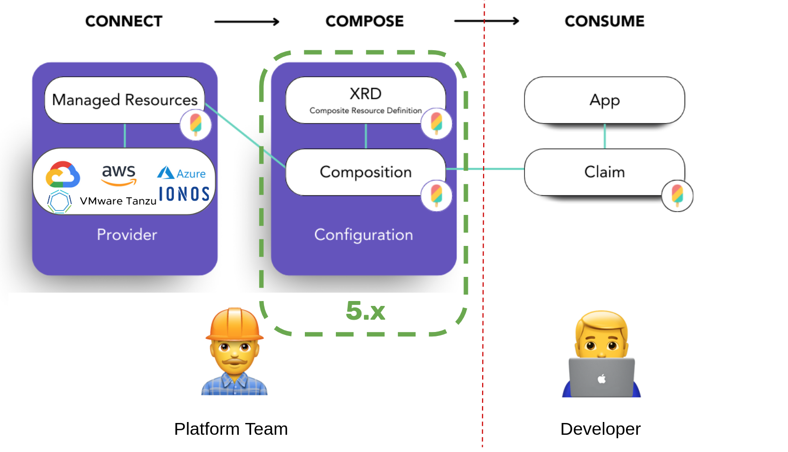
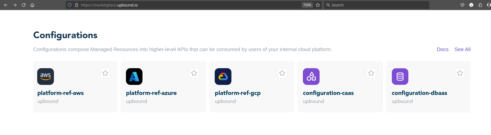
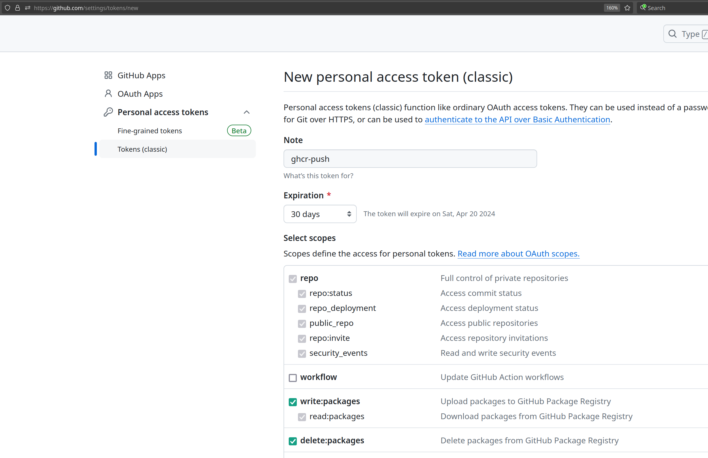
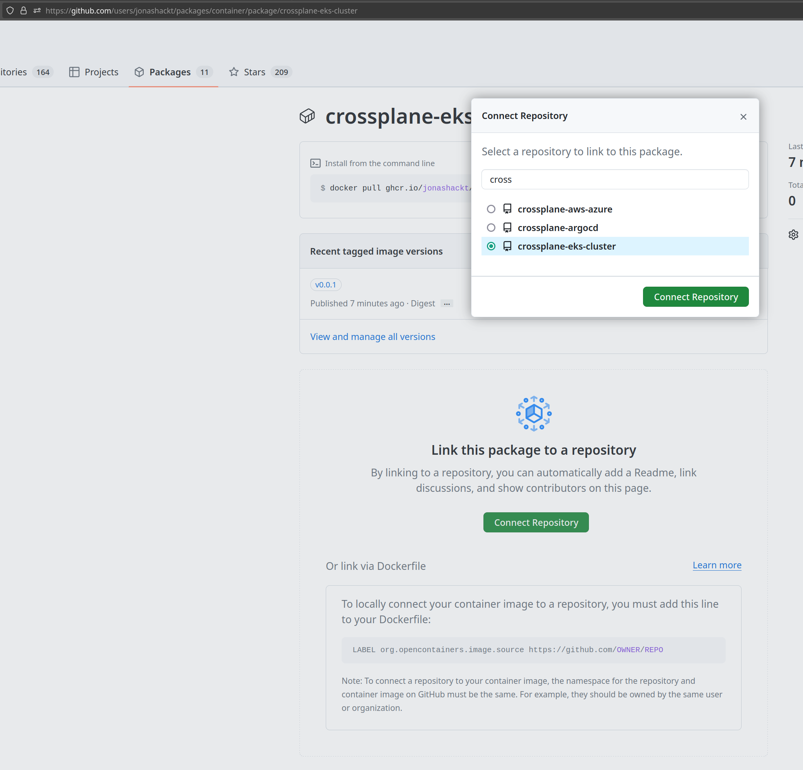
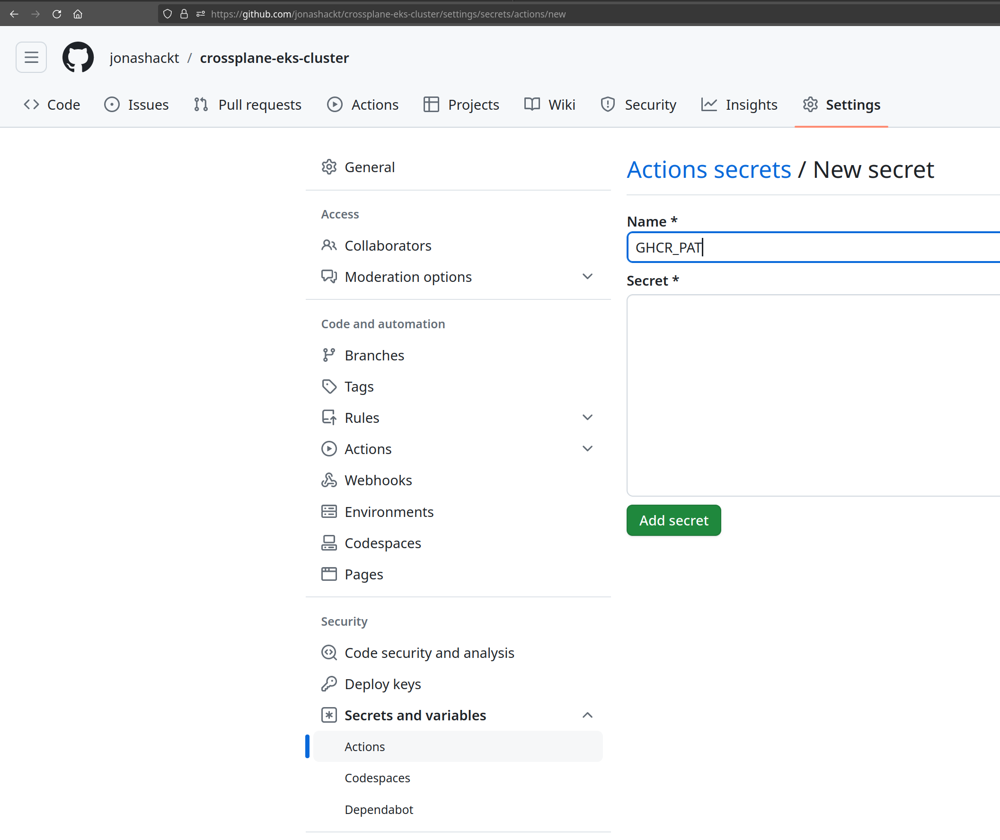

 [🔼 training overview](README.md)

# 5. Managing Compositions: Configuration Packages

How to develop your Compositions & package, publish and consume them in a Crossplane Configuration Packages (OCI.). You will create your own Composition Repository, structure it using a valid folder layout and get familiar with the `crossplane xpkg` command. After publishing your first Crossplane Configuration Package, you will consume & use it in your management cluster.



https://docs.crossplane.io/latest/concepts/packages/

There are also some (currently really only a few) [pre-defined Configurations available](https://marketplace.upbound.io/configurations) in the upbound marketplace:



_We will now gain the knowledge how to create our own Configuration!_ These are the steps to create your own Configuration Package:

0. Install Crossplane CLI
1. Create a new (GitHub) Repository
1. Create crossplane.yaml
2. Builde the Package using Crossplane CLI
3. Push the Package file .xpkg to a Container Registry (e.g. GitHub CR)
4. Optional: Build & Publish Configuration Packages automatically with GitHub Actions
5. Install the Configuration Package into the management cluster
6. Create a new Configuration Package Version and install it into the management cluster
7. (Optional) Create a new Configuration Package version and install it into the management cluster

We'll go through each step on after another:


## 5.1 Create a new (GitHub) Repository

> 📝 As a recommendation, a Composition (or multiple nested Compositions) should be developed in their own Git Repository.

> 📝 With this approach they can be tested in isolation and are distributed & used via a Crossplane Configuration Package (OCI image) from a Container Registry.

Therefore head over to your GitHub account and create a new Repository now. Name it accordingly to your Composition. E.g. `objectstorage-composition`:


Clone the repository locally via:

```shell
git clone git@github.com:yourGitHubUserNameHere/objectstorage-composition.git
```

## 5.2 Create crossplane.yaml

As [stated in the docs](https://docs.crossplane.io/latest/concepts/packages/#create-a-configuration) Crossplane has a feature where one can create Configuration Packages containing specific Compositions packaged in a OCI container. So let's build a Configuration Package from our AWS S3 Composition here.

Here's also a full example [`crossplane.yaml`](crossplane.yaml):

```yaml
apiVersion: meta.pkg.crossplane.io/v1alpha1
kind: Configuration
metadata:
  name: crossplane-eks-cluster
  annotations:
    # Set the annotations defining the maintainer, source, license, and description of your Configuration
    meta.crossplane.io/maintainer: Jonas Hecht iam@jonashackt.io
    meta.crossplane.io/source: github.com/jonashackt/crossplane-eks-cluster
    # Set the license of your Configuration
    meta.crossplane.io/license: MIT
    meta.crossplane.io/description: |
      Crossplane Configuration delivering CRDs to provision AWS EKS clusters.
    meta.crossplane.io/readme: |
      It's a Nested Composition with separate AWS Networking & EKS cluster setups.
spec:
  dependsOn:
    - provider: xpkg.upbound.io/upbound/provider-aws-ec2
      version: ">=v1.1.1"
    - provider: xpkg.upbound.io/upbound/provider-aws-iam
      version: ">=v1.1.1"
    - provider: xpkg.upbound.io/upbound/provider-aws-eks
      version: ">=v1.1.1"
  crossplane:
    version: ">=v1.15.1-0"
```

Don't forget to add the `metadate.annotations` in order to prevent the error `crossplane: error: failed to build package: not exactly one package meta type` - see also https://stackoverflow.com/questions/78200917/crossplane-error-failed-to-build-package-not-exactly-one-package-meta-type

Also we should define on which providers our Configuration depends on - and also on which Crossplane version.

> 📝 There's a template one could use to create the crossplane.yaml using the crossplane CLI: https://docs.crossplane.io/latest/cli/command-reference/#beta-xpkg-init 

```shell
crossplane beta xpkg init objectstorage-composition configuration-template
```

The command uses the following template: https://github.com/crossplane/configuration-template (one could provide arbitrary repositories to the command).


## 5.3 Build the Package using Crossplane CLI

The Crossplane CLI [has the right command for us](https://docs.crossplane.io/latest/concepts/packages/#build-the-package):

```shell
crossplane xpkg build --package-root=. --examples-root="./examples" --ignore=".github/workflows/*,crossplane/provider/*,kuttl-test.yaml,tests/compositions/s3/*" --verbose
```

Note that including YAML files that aren’t Compositions or CompositeResourceDefinitions, including Claims isn’t supported.

This can be done by appending `--ignore="file.xyz,directory/*"`, which will ignore a file `file.xyz` and all files in directory `directory`. [Sadly, ingoring directories completely isn't supported right now](https://docs.crossplane.io/latest/concepts/packages/#build-the-package) - so we need to define all our kuttl test directories respectively.

Also appending `--verbose` makes a lot of sense to see what's going on.


## 5.4 Push the Package file .xpkg to GitHub Container Registry

There's also a `crossplane xpkg push` command to publish the Configuration package. So let's create a new GitHub package matching our repository:

```shell
crossplane xpkg push ghcr.io/yourGitHubUserName/objectstorage-composition:v0.0.1
```

You can leverage the Container image tag as version number for your Configuration here.

If the command gives the following error, we need to setup Authentication for your Docker Registry:

```shell
crossplane: error: failed to push package file crossplane-eks-cluster-7badc365c06a.xpkg: Post "https://ghcr.io/v2/jonashackt/crossplane-eks-cluster/blobs/uploads/": GET https://ghcr.io/token?scope=repository%3Ajonashackt%2Fcrossplane-eks-cluster%3Apull&scope=repository%3Ajonashackt%2Fcrossplane-eks-cluster%3Apush%2Cpull&service=ghcr.io: DENIED: requested access to the resource is denied
```

The ` crossplane xpkg push --help` helps us:

> Credentials for the registry are automatically retrieved from xpkg
login and dockers configuration as fallback.

So we need to login to GitHub Container Registry first in order to be able to push our OCI image:

```shell
echo YourGitHubPersonalAccessTokenHere | docker login ghcr.io -u YourAccountOrGHOrgaNameHere --password-stdin
```

Make sure to use a Personal Access Token as described in this post https://www.codecentric.de/wissens-hub/blog/github-container-registry. Head over to your user `Settings`/`Developer Settings` and to `Personal Access Tokens`. Click on `Personal access tokens (classic)` and create a classic token with the following scopes (`repo`, `write:packages` and `delete:packages`):



Additionally we need to add the domain configuration like this: `--domain=https://ghcr.io`. Otherwise the default domain is `upbound.io` which will lead to non pushed Configurations - only visible via the `verbose` flag.

With this our `crossplane xpkg push` command should work as expected:

```shell
$ crossplane xpkg push ghcr.io/jonashackt/crossplane-eks-cluster:v0.0.1 --domain=https://ghcr.io --verbose

2024-03-21T16:39:48+01:00	DEBUG	Found package in directory	{"path": "crossplane-eks-cluster-7badc365c06a.xpkg"}
2024-03-21T16:39:48+01:00	DEBUG	Getting credentials for server	{"serverURL": "ghcr.io"}
2024-03-21T16:39:48+01:00	DEBUG	No profile specified, using default profile
2024-03-21T16:39:49+01:00	DEBUG	Pushed package	{"path": "crossplane-eks-cluster-7badc365c06a.xpkg", "ref": "ghcr.io/jonashackt/crossplane-eks-cluster:v0.0.1"}
```

Now head over to your GitHub Organisation's `Packages` tab and search for the newly created package:



Click onto the package and connect the GitHub Repository.

Also - on the right - click on `Package settings` and scroll down to the `Danger Zone`. There click on `Change visibility` and change it to public. Now your Crossplane Configuration should be available for download without login.

If everything went fine, the package / OCI image should now be visible at your repository.


## 5.5 Optional: Build & Publish your Configuration Package automatically with GitHub Actions

So let's finally do it all automatically on Composition code changes (git commit/push) using GitHub Actions. We simply extend our workflow at [.github/workflows/test-composition-and-publish-to-ghcr.yml](.github/workflows/test-composition-and-publish-to-ghcr.yml) and do all the steps from above:

```yaml
name: publish

on: [push]

env:
  GHCR_PAT: ${{ secrets.GHCR_PAT }}
  CONFIGURATION_VERSION: "v0.0.2"

jobs:
  resouces-rendering-test:
    ...

jobs:
  build-configuration-and-publish-to-ghcr:
    needs: resouces-rendering-test
    runs-on: ubuntu-latest

    steps:
      - uses: actions/checkout@v4

      - name: Login to GitHub Container Registry
        uses: docker/login-action@v3
        with:
          registry: ghcr.io
          username: ${{ github.actor }}
          password: ${{ secrets.GHCR_PAT }}

      - name: Install Crossplane CLI
        run: |
          curl -sL "https://raw.githubusercontent.com/crossplane/crossplane/master/install.sh" |sh
          sudo mv crossplane /usr/local/bin

      - name: Build Crossplane Configuration package & publish it to GitHub Container Registry
        run: |
          echo "### Build Configuration .xpkg file"
          crossplane xpkg build --package-root=. --examples-root="./examples" --ignore=".github/workflows/*,crossplane/install/*,crossplane/provider/*,kuttl-test.yaml,tests/compositions/eks/*,tests/compositions/networking/*" --verbose

          echo "### Publish as OCI image to GHCR"
          crossplane xpkg push "ghcr.io/jonashackt/crossplane-eks-cluster:$CONFIGURATION_VERSION" --domain=https://ghcr.io --verbose
```

As we added the `.github/workflows` directory with a workflow yaml file, the `crossplane xpkg build` command also tries to include it. Therefore the command locally need to exclude the workflow file also:

```shell
crossplane xpkg build --package-root=. --examples-root="./examples" --ignore=".github/workflows/*,crossplane/install/*,crossplane/provider/*,kuttl-test.yaml,tests/compositions/eks/*,tests/compositions/networking/*" --verbose
```

`--ignore=".github/*` won't work, since the command doesn't support to exclude directories - only wildcards IN directories.

Also to prevent the following error:

```shell
crossplane: error: failed to push package file crossplane-eks-cluster-7badc365c06a.xpkg: PUT https://ghcr.io/v2/jonashackt/crossplane-eks-cluster/manifests/v0.0.2: DENIED: installation not allowed to Write organization package
```

we use the Personal Access Token (PAT) we already created above also in our GitHub Actions Workflow instead of the default `GITHUB_TOKEN` in order to have the correct permissions. Therefore create it as a new Repository Secret:



With this we should also be able to use a ENV var for our Configuration version or even `latest`.


## 5.6 Install the Configuration Package into management cluster

First delete your Composition and XRD in the management cluster:

```shell
kubectl delete -f apis/s3/composition.yaml
kubectl delete -f apis/s3/definition.yaml
```

As described in https://docs.crossplane.io/latest/concepts/packages/#install-a-configuration use a manifest like the following to install the Configuration. 

Therefore create a new file in the `apis` directory (since this is a Crossplane API / CRD we will be using) and name it `objectstorage-composition.yaml` (just as our Composition is named):

```yaml
apiVersion: pkg.crossplane.io/v1
kind: Configuration
metadata:
  name: objectstorage-composition
spec:
  package: ghcr.io/jonashackt/objectstorage-composition:v0.0.1
```

Now install all APIs in the `apis` folder via:

```shell
kubectl apply -f apis/objectstorage-composition.yaml
```

As you're already used to, create (or re-use) a Claim to use the newly installed API:

```yaml
apiVersion: crossplane.jonashackt.io/v1alpha1
kind: ObjectStorage
metadata:
  namespace: default
  name: managed-upbound-s3
spec:
  compositionRef:
    name: objectstorage-composition
  
  parameters:
    bucketName: crossplane-training-yourNameHere
    region: eu-central-1
```

Run `kubectl get crossplane` and after applying the new Configuration here, there should appear all the Compositions and XRDs.


## (Optional) 5.7 Create a new Configuration Package Version and install it into the management cluster

Change something in your Composition to change and then build a new Package using Crossplane CLI. Publish the Package to the GitHub Container Registry and install it to the management cluster.

What happens? Observe the cluster Events e.g. using `k9s`.