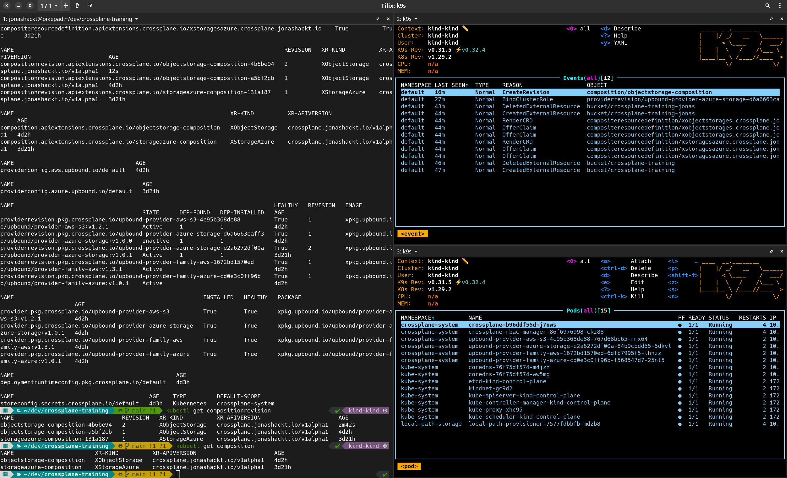
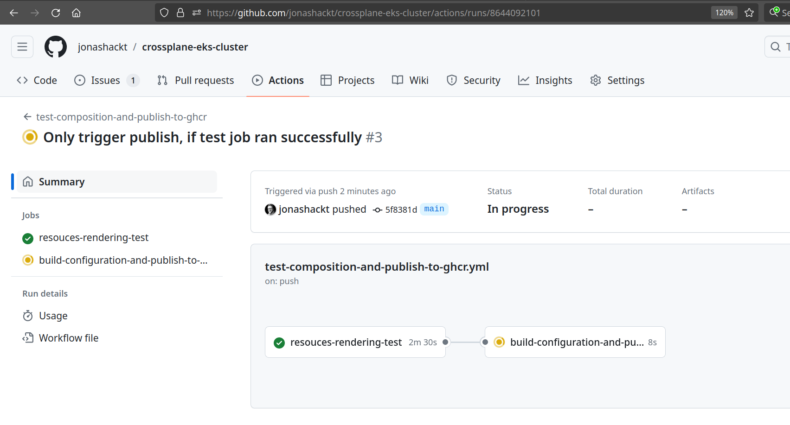

# crossplane-training
Crossplane training & hands-on workshop materials

This repo contains a training about [crossplane.io](https://www.crossplane.io/) and uses lecture & hands-on tasks to introduce the __cloud native control plane framework__. This repo focusses on AWS, but can be easily adapted to other (cloud) computing vendors.

## Prerequisites

AWS iam user with rights to deploy S3, IAM roles, EC2 instances, VPCs & networking components (Subnets, SecurityGroups & Rules, etc), EKS clusters & node groups.


### CLI tools: kind, helm, kubectl, AWS CLI, k9s

First be sure to have kind, the package manager Helm and kubectl installed:

```shell
# Mac
brew install kind helm kubectl

# Manjaro
pamac install kind-bin helm kubectl-bin
```

Also [install aws CLI and configure it](https://docs.aws.amazon.com/cli/latest/userguide/getting-started-install.html):

```shell
# Mac
brew install awscli

# Manjaro
pamac install aws-cli 
```

The command `aws configure` should work on your system.

Additionally we should have the [K8s workbench k9s](https://k9scli.io/) in place:

```shell
# See https://k9scli.io/topics/install/
# Mac / Linux
brew install derailed/k9s/k9s

# Manjaro
pamac install k9s
```

Now before working with Crossplane, let's prepare our console a bit. Using `k9s` you will be able to get much more insights into what Crossplane is doing! Here's my setup using a tiling Console using Tilix for example:




### A local K8s cluster with kind & CLI tools

In order to use Crossplane we'll need any kind of Kubernetes cluster to let it operate in. This management cluster with Crossplane installed will then provision the defined infrastructure. Using any managed Kubernetes cluster like EKS, AKS and so on is possible - or even a local [Minikube](https://minikube.sigs.k8s.io/docs/start/), [kind](https://kind.sigs.k8s.io) or [k3d](https://k3d.io/).

> For this training we're using [kind](https://kind.sigs.k8s.io).

Spin up a local kind cluster

```shell
kind create cluster --image kindest/node:v1.29.2 --wait 5m
```


### Install Crossplane CLI

> For this training we need Crossplane CLI >= `v1.15.0`!

https://github.com/crossplane/crossplane/releases/tag/v1.15.0

> Enhancements to the Crossplane CLI: New subcommands like `crossplane beta validate` for schema validation, `crossplane beta top` for resource utilization views similar to `kubectl top pods`, and `crossplane beta convert` for converting resources to newer formats or configurations.

Install crossplane CLI:

```shell
curl -sL "https://raw.githubusercontent.com/crossplane/crossplane/master/install.sh" |sh
```

If that produces an error like `Failed to download Crossplane CLI. Please make sure version current exists on channel stable.`, try to manually craft the download link:

```shell
curl --output crank "https://releases.crossplane.io/stable/current/bin/linux_amd64/crank"
chmod +x crank
sudo mv crank /usr/local/bin/crossplane
```

Be sure to have the `v1.15.0` version installed as a minimum, otherwise the `crossplane beta validate` command won't work:

```shell
crossplane --version
v1.15.0
```


### Install kuttl kubectl plugin

https://kuttl.dev/docs/cli.html 

```shell
# On a Mac
brew tap kudobuilder/tap
brew install kuttl-cli
```

Alternatively: One of the best ways to install a kubectl plugin is to use the package manager [krew](https://github.com/kubernetes-sigs/krew). So first install krew via your preferred package manager (see https://krew.sigs.k8s.io/docs/user-guide/setup/install/).

Now install kuttl via krew:

```shell
$ kubectl krew install kuttl

WARNING: To be able to run kubectl plugins, you need to add
the following to your ~/.zshrc:

    export PATH="${KREW_ROOT:-$HOME/.krew}/bin:$PATH"

and restart your shell.
```

Add the `export ...` statement to your shell configuration as mentioned in the install statement.

Now testdrive kuttl:

```shell
$ kubectl kuttl --version
kubectl-kuttl version 0.15.0
```


# Training overview


# 1. Crossplane intro & basic concepts

### 1.1 Crossplane concepts: Managed Resources, Providers & Families, Configuration Packages

Crossplane https://crossplane.io/ claims to be the "The cloud native control plane framework". It introduces a new way how to manage any cloud resource (beeing it Kubernetes-native or not). It's an alternative Infrastructure-as-Code tooling to Terraform, AWS CDK/Bicep or Pulumi and introduces a higher level of abstraction - based on Kubernetes CRDs. 

Literally the best intro post to Crossplane for me was https://blog.crossplane.io/crossplane-vs-cloud-infrastructure-addons/ - here the real key benefits especially compared to other tools are described. Without marketing blabla. If you love deep dives, I can also recommend Nate Reid's blog https://vrelevant.net/ who works as Staff Solutions Engineer at Upbound.

https://docs.crossplane.io/latest/concepts/

* [Managed Resourced (MR)](https://crossplane.io/docs/v1.8/concepts/managed-resources.html): Kubernetes custom resources (CRDs) that represent infrastructure primitives (mostly in cloud providers). All Crossplane Managed Resources could be found via https://doc.crds.dev/ 
* [Composite Resources (XR)](https://crossplane.io/docs/v1.8/concepts/composition.html): compose Managed Resources into higher level infrastructure units (especially interesting for platform teams). They are defined by:
    * a `CompositeResourceDefinition` (XRD) (which defines an OpenAPI schema the `Composition` needs to be conform to)
    * (optional) `CompositeResourceClaims` (XRC) (which is an abstraction of the XR for the application team to consume) - but is fantastic to hold the exact configuration parameters for the concrete resources you want to provision
    * a `Composition` that describes the actual infrastructure primitives aka `Managed Resources` used to build the Composite Resource. One XRD could have multiple Compositions - e.g. to one for every environment like development, stating and production
    * and configured by a `Configuration`
* [Packages](https://crossplane.io/docs/v1.8/concepts/packages.html): OCI container images to handle distribution, version updates, dependency management & permissions for Providers & Configurations. Packages were formerly named `Stacks`.
    * [Providers](https://crossplane.io/docs/v1.8/concepts/providers.html): are Packages that bundle a set of Managed Resources & __a Controller to provision infrastructure resources__ - all providers can be found on GitHub, e.g. [provider-aws](https://github.com/crossplane-contrib/provider-aws) or on [docs.crds.dev](https://doc.crds.dev/github.com/crossplane/provider-aws). A [list of all available Providers](https://github.com/orgs/crossplane-contrib/repositories?type=all) can also be found on GitHub.
    * [Configuration](https://crossplane.io/docs/v1.8/getting-started/create-configuration.html): define your own Composite Resources (XRs) & package them via `kubectl crossplane build configuration` (now they are a Package) - and push them to an OCI registry via `kubectl crossplane push configuration`. With this Configurations can also be easily installed into other Crossplane clusters.


IaC with control planes: what about state?

The "management cluster"

Basic concepts, Managed Resources (MR), Providers (incl. crossplane-contrib vs. upbound, Provider Families, based on Terraform)

Embedding Crossplane into GitOps processes


### 1.2 Hands-On: Install Crossplane

#### 1.2.1 Plain via Helm

The Crossplane docs [tell us to use Helm for installation](https://docs.crossplane.io/latest/software/install/):

```shell
helm repo add crossplane-stable https://charts.crossplane.io/stable
helm repo update

helm upgrade --install crossplane --namespace crossplane-system --create-namespace crossplane-stable/crossplane
```

Using the appended `--create-namespace`, we don't need to explicitely create the namespace before running `helm upgrade`.


#### 1.2.2 Renovate-powered installation via local Helm Chart

As an Renovate-powered alternative we can [create our own simple [Chart.yaml](crossplane-install/Chart.yaml) to enable automatic updates](https://stackoverflow.com/a/71765472/4964553) of our installation if new crossplane versions get released:

```yaml
apiVersion: v2
type: application
name: crossplane
version: 0.0.0 # unused
appVersion: 0.0.0 # unused
dependencies:
  - name: crossplane
    repository: https://charts.crossplane.io/stable
    version: 1.15.1
```

To install Crossplane using our own `Chart.yaml` simply run:

```shell
helm dependency update crossplane-install
helm upgrade --install crossplane --namespace crossplane-system crossplane-install --create-namespace
```

Be sure to exclude `charts` and `Chart.lock` files via [.gitignore](.gitignore):

```shell
# Exclude Helm charts lock and packages
**/**/charts
**/**/Chart.lock
```


#### 1.2.3 Check Crossplane installation

Check Crossplane version installed with `helm list -n crossplane-system` :

```shell
$ helm list -n crossplane-system
NAME      	NAMESPACE        	REVISION	UPDATED                              	STATUS  	CHART           	APP VERSION
crossplane	crossplane-system	1       	2022-06-21 09:28:21.178357 +0200 CEST	deployed	crossplane-1.8.1	1.8.1
```

Before we can actually apply a Provider we have to make sure that crossplane is actually healthy and running. Therefore we can use the `kubectl wait` command like this:

```shell
kubectl wait --for=condition=ready pod -l app=crossplane --namespace crossplane-system --timeout=120s
```

Otherwise we will run into errors like this when applying a `Provider`:

```shell
error: resource mapping not found for name: "provider-aws" namespace: "" from "provider-aws.yaml": no matches for kind "Provider" in version "pkg.crossplane.io/v1"
ensure CRDs are installed first
```

Finally check crossplane status with `kubectl get all -n crossplane-system`:

```shell
$ kubectl get all -n crossplane-system
NAME                                           READY   STATUS    RESTARTS   AGE
pod/crossplane-7c88c45998-d26wl                1/1     Running   0          69s
pod/crossplane-rbac-manager-8466dfb7fc-db9rb   1/1     Running   0          69s

NAME                                     TYPE        CLUSTER-IP      EXTERNAL-IP   PORT(S)    AGE
service/crossplane-webhooks              ClusterIP   10.96.160.156   <none>        9443/TCP   4d

NAME                                      READY   UP-TO-DATE   AVAILABLE   AGE
deployment.apps/crossplane                1/1     1            1           69s
deployment.apps/crossplane-rbac-manager   1/1     1            1           69s

NAME                                                 DESIRED   CURRENT   READY   AGE
replicaset.apps/crossplane-7c88c45998                1         1         1       69s
replicaset.apps/crossplane-rbac-manager-8466dfb7fc   1         1         1       69s
```

> "The base Crossplane installation consists of two pods, the crossplane pod and the crossplane-rbac-manager pod. Before starting the core Crossplane container an init container runs. The init container installs the core Crossplane Custom Resource Definitions (CRDs), configures Crossplane webhooks and installs any supplied Providers or Configurations."" See https://docs.crossplane.io/latest/concepts/pods/

Now we should be able to find some new Kubernetes API objects:

```shell
$ kubectl api-resources  | grep crossplane
compositeresourcedefinitions               xrd,xrds     apiextensions.crossplane.io/v1         false        CompositeResourceDefinition
compositionrevisions                       comprev      apiextensions.crossplane.io/v1         false        CompositionRevision
compositions                               comp         apiextensions.crossplane.io/v1         false        Composition
environmentconfigs                         envcfg       apiextensions.crossplane.io/v1alpha1   false        EnvironmentConfig
usages                                                  apiextensions.crossplane.io/v1alpha1   false        Usage
configurationrevisions                                  pkg.crossplane.io/v1                   false        ConfigurationRevision
configurations                                          pkg.crossplane.io/v1                   false        Configuration
controllerconfigs                                       pkg.crossplane.io/v1alpha1             false        ControllerConfig
deploymentruntimeconfigs                                pkg.crossplane.io/v1beta1              false        DeploymentRuntimeConfig
functionrevisions                                       pkg.crossplane.io/v1beta1              false        FunctionRevision
functions                                               pkg.crossplane.io/v1beta1              false        Function
locks                                                   pkg.crossplane.io/v1beta1              false        Lock
providerrevisions                                       pkg.crossplane.io/v1                   false        ProviderRevision
providers                                               pkg.crossplane.io/v1                   false        Provider
storeconfigs                                            secrets.crossplane.io/v1alpha1         false        StoreConfig
```


> Discussion installation Crossplane (Helm, local Chart, ArgoCD,...)


### 1.3 Hands-On: Install & configure a Crossplane Provider

Provider-Konfiguration am Beispiel AWS: Secret, Provider, ProviderConfig (incl. Diskussion Unterschiede zu Provider Azure)

https://docs.crossplane.io/latest/getting-started/provider-aws/

In order to install & configure the AWS Provider there are these steps to take:

1. Choose a Crossplane AWS Provider
2. Using the official Upbound (Upjet generated) AWS Provider
3. Create aws-creds.conf file
4. Create AWS Provider secret
5. Create ProviderConfig to consume AWS Provider secret


#### 1.3.1 Choose a Crossplane AWS Provider

Currently there are two crossplane providers for AWS:

* https://github.com/crossplane-contrib/provider-aws (legacy now)
* https://github.com/upbound/provider-aws

The first is written "by hand" and supports around 200 Managed Resources and the other is generated using Upjet supporting the full AWS API with 924 Managed Resources. 

The second provider, which is also called the Upbound "official" provider has been donated to the OpenSource community in September 2023 - so there are now 2 OpenSource providers for AWS. 

Which one should you choose? [This issue clarifies it](https://github.com/crossplane-contrib/provider-aws/issues/1954#issuecomment-1862593913):

> "Upbound (the company behind crossplane) has moved to its own Terraform-based set of providers. This means that https://github.com/crossplane-contrib/provider-aws is now only maintained by community volunteers since there is a number of people out there who are still using it. __It is kind of legacy but it will receive further updates as long as the community is willing to contribute to it.__ 

Until June 2023 the Upbound providers had a problem. As Managed Resources are CRDs, the Upbound provider introduced a problem to most control planes, since Kubernetes wasn't designed for that amount of CRDs. I gave [a talk about crossplane at our local DevOps Meetup](https://www.meetup.com/de-DE/devopsthde/events/293211158/) and already struggled with the Upbound AWS provider.

Therefore in June 2023 the Upjet generated official Upbound provider has been split into Provider Families: https://blog.crossplane.io/crd-scaling-provider-families/ These split up Upbound providers are the way to go if you start using crossplane today:


The [migration guide](https://docs.upbound.io/providers/migration/) also states that the monolithic provider is already deprecated:

> "Warning: The monolithic AWS provider (upbound/provider-aws) has been deprecated in favor of the AWS provider family. You can read more about the provider families in our blog post and the official documentation for the provider families is here. We will continue support for the monolithic AWS provider until June 12, 2024. https://marketplace.upbound.io/providers/upbound/provider-aws/"

So head over to [the Upbound marketplace](https://marketplace.upbound.io/) and search for your provider familiy. As we want to use AWS S3 for example, here we went with https://marketplace.upbound.io/providers/upbound/provider-aws-s3.


#### 1.3.2 Using the official Upbound (Upjet generated) AWS Provider

https://marketplace.upbound.io/providers/upbound/provider-aws-s3

Now we can install the Upbound AWS Provider. Therefore create a directory `upbound/provider-aws/provider` directory with a file `upbound-provider-aws-s3.yaml`: 

```yaml
apiVersion: pkg.crossplane.io/v1
kind: Provider
metadata:
  name: upbound-provider-aws-s3
spec:
  package: xpkg.upbound.io/upbound/provider-aws-s3:v1.2.1
  packagePullPolicy: IfNotPresent # Only download the package if it isn’t in the cache.
  revisionActivationPolicy: Automatic # Otherwise our Provider never gets activate & healthy
  revisionHistoryLimit: 1
```

Install it via `kubectl`:


```shell
kubectl apply -f upbound/provider-aws-s3/config/provider-aws-s3.yaml
```

The `package` version in combination with the `packagePullPolicy` configuration here is crucial, since we can configure an update strategy for the Provider here. ~~I'am not sure, if the Crossplane team will provide an installation method where we can use tools like Renovate to keep our Crossplane providers up to date~~ (now Renovate supports Crossplane, see paragraph `Provider & Configuration Package Upgrades with Renovate`). A full table of all possible fields can be found in the docs: https://crossplane.io/docs/v1.8/concepts/packages.html#specpackagepullpolicy We can also let crossplane itself manage new versions for us. But we also leave the GitOps way here!

Multiple Provider Package revisions can also be installed at the same time (especially when using `packagePullPolicy: Always`). If you installed multiple package versions, you'll see them as `providerrevision.pkg.x` when running `kubectl get crossplane`:

```shell
$ kubectl get crossplane
...
NAME                                                                             HEALTHY   REVISION   IMAGE                                                   STATE      DEP-FOUND   DEP-INSTALLED   AGE
providerrevision.pkg.crossplane.io/upbound-provider-aws-s3-4c95b368de88          True      1          xpkg.upbound.io/upbound/provider-aws-s3:v1.2.1          Active     1           1               3d23h
providerrevision.pkg.crossplane.io/upbound-provider-aws-s3-d6a6663caff3          True      1          xpkg.upbound.io/upbound/provider-aws-s3:v1.1.0          Inactive   1           1               5d22h
...
```

As our first Crossplane Provider has been installed. We need to wait for the Provider to become healthy:

```shell
kubectl wait "providers.pkg.crossplane.io/upbound-provider-aws-s3" --for=condition=Healthy --timeout=180s
```

Obtain the status via `kubectl get provider.pkg.crossplane.io`:

```shell
$ kubectl get provider.pkg.crossplane.io
NAME                          INSTALLED   HEALTHY   PACKAGE                                               AGE
upbound-provider-aws-s3       True        True      xpkg.upbound.io/upbound/provider-aws-s3:v0.46.0       113s
upbound-provider-family-aws   True        True      xpkg.upbound.io/upbound/provider-family-aws:v0.46.0   108s
```

Otherwise we may run into errors like this when applying the `ProviderConfig` right after the Provider.


#### 1.3.3 Create aws-creds.conf file

With this prepared [we can create an `aws-creds.conf` file](https://docs.crossplane.io/latest/getting-started/provider-aws/#generate-an-aws-key-pair-file):

```shell
echo "[default]
aws_access_key_id = $(aws configure get aws_access_key_id)
aws_secret_access_key = $(aws configure get aws_secret_access_key)
" > aws-creds.conf
```

> Don't ever check this file into source control - it holds your AWS credentials! Add it to your [.gitignore](.gitignore) file right now:

```shell
# Exclude credential configuration files like aws-creds.conf
*-creds.conf
```


### 1.3.4 Create AWS Provider secret

Now we need to use the `aws-creds.conf` file to create the Crossplane AWS Provider secret:

```shell
kubectl create secret generic aws-creds -n crossplane-system --from-file=creds=./aws-creds.conf
```

If everything went well there should be a new `aws-creds` Secret ready:


### 1.3.5 Create ProviderConfig to consume AWS Provider secret

To get our Provider working we also need to create a matching `ProviderConfig` that will tell the Provider where to find it's AWS credentials. Therefore we create a new directory `upbound/provider-aws/config` with a new file `provider-config-aws.yaml` inside:

```yaml
apiVersion: aws.upbound.io/v1beta1
kind: ProviderConfig
metadata:
  name: default
spec:
  credentials:
    source: Secret
    secretRef:
      namespace: crossplane-system
      name: aws-creds
      key: creds
```

> Crossplane resources use the `ProviderConfig` named `default` if no specific ProviderConfig is specified, so this ProviderConfig will be the default for all AWS resources.

The `secretRef.name` and `secretRef.key` has to match the fields of the already created Secret.

Apply it via `kubectl`:


```shell
kubectl apply -f upbound/provider-aws/config/provider-config-aws.yaml
```

Now we should have everything in place to use the Upbound AWS Provider! We can double check via `kubectl get crossplane`:

```shell
$ kubectl get crossplane
NAME                                    AGE
providerconfig.aws.upbound.io/default   55s

NAME                                                                             HEALTHY   REVISION   IMAGE                                                   STATE      DEP-FOUND   DEP-INSTALLED   AGE
providerrevision.pkg.crossplane.io/upbound-provider-aws-s3-4c95b368de88          True      1          xpkg.upbound.io/upbound/provider-aws-s3:v1.2.1          Active     1           1               3d23h

NAME                                                        INSTALLED   HEALTHY   PACKAGE                                                 AGE
provider.pkg.crossplane.io/upbound-provider-aws-s3          True        True      xpkg.upbound.io/upbound/provider-aws-s3:v1.2.1          3d23h

NAME                                        AGE   TYPE         DEFAULT-SCOPE
storeconfig.secrets.crossplane.io/default   4d    Kubernetes   crossplane-system
```


Now we should have some more Kubernetes API resources available:

```shell
$ kubectl api-resources | grep aws
providerconfigs                                         aws.upbound.io/v1beta1                 false        ProviderConfig
providerconfigusages                                    aws.upbound.io/v1beta1                 false        ProviderConfigUsage
storeconfigs                                            aws.upbound.io/v1alpha1                false        StoreConfig
bucketaccelerateconfigurations                          s3.aws.upbound.io/v1beta1              false        BucketAccelerateConfiguration
bucketacls                                              s3.aws.upbound.io/v1beta1              false        BucketACL
bucketanalyticsconfigurations                           s3.aws.upbound.io/v1beta1              false        BucketAnalyticsConfiguration
bucketcorsconfigurations                                s3.aws.upbound.io/v1beta1              false        BucketCorsConfiguration
bucketintelligenttieringconfigurations                  s3.aws.upbound.io/v1beta1              false        BucketIntelligentTieringConfiguration
bucketinventories                                       s3.aws.upbound.io/v1beta1              false        BucketInventory
bucketlifecycleconfigurations                           s3.aws.upbound.io/v1beta1              false        BucketLifecycleConfiguration
bucketloggings                                          s3.aws.upbound.io/v1beta1              false        BucketLogging
bucketmetrics                                           s3.aws.upbound.io/v1beta1              false        BucketMetric
bucketnotifications                                     s3.aws.upbound.io/v1beta1              false        BucketNotification
bucketobjectlockconfigurations                          s3.aws.upbound.io/v1beta1              false        BucketObjectLockConfiguration
bucketobjects                                           s3.aws.upbound.io/v1beta1              false        BucketObject
bucketownershipcontrols                                 s3.aws.upbound.io/v1beta1              false        BucketOwnershipControls
bucketpolicies                                          s3.aws.upbound.io/v1beta1              false        BucketPolicy
bucketpublicaccessblocks                                s3.aws.upbound.io/v1beta1              false        BucketPublicAccessBlock
bucketreplicationconfigurations                         s3.aws.upbound.io/v1beta1              false        BucketReplicationConfiguration
bucketrequestpaymentconfigurations                      s3.aws.upbound.io/v1beta1              false        BucketRequestPaymentConfiguration
buckets                                                 s3.aws.upbound.io/v1beta1              false        Bucket
bucketserversideencryptionconfigurations                s3.aws.upbound.io/v1beta1              false        BucketServerSideEncryptionConfiguration
bucketversionings                                       s3.aws.upbound.io/v1beta1              false        BucketVersioning
bucketwebsiteconfigurations                             s3.aws.upbound.io/v1beta1              false        BucketWebsiteConfiguration
objectcopies                                            s3.aws.upbound.io/v1beta1              false        ObjectCopy
objects                                                 s3.aws.upbound.io/v1beta1              false        Object
```


### 1.4 Hands-On: Using your first Managed Resource (AWS S3)

Let's create our first Crossplane Managed Resource, which should deploy a actual AWS S3 Bucket!

Therefore create a new directory `infrastructure/s3` and a file `simple-bucket.yaml`.

Search [the Provider docs on the Upbound Marketplace ](https://marketplace.upbound.io/providers/upbound/provider-aws-s3)for the `Bucket` resource and create your first Managed Resource.


Example:

```yaml
apiVersion: s3.aws.upbound.io/v1beta1
kind: Bucket
metadata:
  name: crossplane-training-yourNameHere
spec:
  forProvider:
    region: eu-central-1
```

> Now before applying the Managed Resource, let's have a look if our terminal is ready: Check the right pane in `k9s` and type `:events` to see the management cluster events there. Also press `Shift + L` to see the latest events on top. More [shortcuts in k9s can be found here](https://www.hackingnote.com/en/cheatsheets/k9s/).


When you're ready apply it to your management cluster:

```shell
kubectl apply -f infrastructure/s3/simple-bucket.yaml
```

You should see a `CreatedExternalResource` event in `k9s`.


Check [your AWS Console!](https://eu-central-1.console.aws.amazon.com/s3) Your first Crossplane managed infrastructure resource should come alive.


After having seen the Bucket beeing deployed we also want to know how to delete it again. Therefore run:

```shell
kubectl delete -f infrastructure/s3/simple-bucket.yaml
```

Again there should be an Event in `k9s` visible: a `DeletedExternalResource`.


### 1.5 Validate your MR against Provider schemes

#### 1.5.1 Validate Managed Resources against a Crossplane provider (family)

We need to provide the provider's schemes.

For example grab a Managed Resource (or multiple of them) and validate it against the AWS provider:

```shell
crossplane beta validate --cache-dir ~/.crossplane upbound/provider-aws/provider/provider-aws-s3.yaml infrastructure/s3/simple-bucket.yaml
package schemas does not exist, downloading:  xpkg.upbound.io/upbound/provider-aws-s3:v1.1.0
[✓] s3.aws.upbound.io/v1beta1, Kind=Bucket, crossplane-argocd-s3-bucket validated successfully
[✓] s3.aws.upbound.io/v1beta1, Kind=BucketPublicAccessBlock, crossplane-argocd-s3-bucket-pab validated successfully
[✓] s3.aws.upbound.io/v1beta1, Kind=BucketOwnershipControls, crossplane-argocd-s3-bucket-osc validated successfully
[✓] s3.aws.upbound.io/v1beta1, Kind=BucketACL, crossplane-argocd-s3-bucket-acl validated successfully
[✓] s3.aws.upbound.io/v1beta1, Kind=BucketWebsiteConfiguration, crossplane-argocd-s3-bucket-websiteconf validated successfully
Total 5 resources: 0 missing schemas, 5 success cases, 0 failure cases
```


##### 1.5.2 Validate a full directory against XRDs or Provider schema

We can also validate a full directory:

```shell
crossplane beta validate --cache-dir ~/.crossplane upbound/provider-aws/provider/provider-aws-s3.yaml infrastructure
[!] could not find CRD/XRD for: crossplane.jonashackt.io/v1alpha1, Kind=ObjectStorage
[!] could not find CRD/XRD for: apiextensions.crossplane.io/v1, Kind=Composition
[!] could not find CRD/XRD for: pkg.crossplane.io/v1, Kind=Provider
[!] could not find CRD/XRD for: aws.upbound.io/v1beta1, Kind=ProviderConfig
[!] could not find CRD/XRD for: apiextensions.crossplane.io/v1, Kind=CompositeResourceDefinition
[✓] s3.aws.upbound.io/v1beta1, Kind=Bucket, crossplane-argocd-s3-bucket validated successfully
[✓] s3.aws.upbound.io/v1beta1, Kind=BucketPublicAccessBlock, crossplane-argocd-s3-bucket-pab validated successfully
[✓] s3.aws.upbound.io/v1beta1, Kind=BucketOwnershipControls, crossplane-argocd-s3-bucket-osc validated successfully
[✓] s3.aws.upbound.io/v1beta1, Kind=BucketACL, crossplane-argocd-s3-bucket-acl validated successfully
[✓] s3.aws.upbound.io/v1beta1, Kind=BucketWebsiteConfiguration, crossplane-argocd-s3-bucket-websiteconf validated successfully
Total 10 resources: 5 missing schemas, 5 success cases, 0 failure cases
```


### 1.6 Hands-On: Using multiple Managed Resources (public accessible S3 Bucket)

Now having a simple S3 Bucket already deployed, let's try to create a publicly accessible S3 Bucket using Crossplane Managed Resources. Therefore in `infrastructure/s3` create a new file `public-bucket.yaml`.


TODO: hints for public Bucket


https://github.com/aws/aws-cdk/issues/25288#issuecomment-1522011311

https://doc.crds.dev/github.com/crossplane/provider-aws/s3.aws.crossplane.io/Bucket/v1beta1@v0.39.0

https://docs.aws.amazon.com/AmazonS3/latest/userguide/access-policy-language-overview.html

https://stackoverflow.com/questions/76097031/aws-s3-bucket-cannot-have-acls-set-with-objectownerships-bucketownerenforced-s 

https://marketplace.upbound.io/providers/upbound/provider-aws/v0.34.0/resources/s3.aws.upbound.io/BucketPublicAccessBlock/v1beta1 


According to https://github.com/hashicorp/terraform-provider-aws/issues/28353 and https://registry.terraform.io/providers/hashicorp/aws/latest/docs/resources/s3_bucket_acl we need to separate `Bucket` creation from `BucketPublicAccessBlock`, `BucketOwnershipControls` and `BucketACL` - which should now be available finally leveraging the Upbound AWS Provider:


```yaml
apiVersion: s3.aws.upbound.io/v1beta1
kind: Bucket
metadata:
  name: crossplane-training-yourNameHere
spec:
  forProvider:
    region: eu-central-1
  providerConfigRef:
    name: default
---
apiVersion: s3.aws.upbound.io/v1beta1
kind: BucketPublicAccessBlock
metadata:
  name: crossplane-training-yourNameHere-pab
spec:
  forProvider:
    blockPublicAcls: false
    blockPublicPolicy: false
    ignorePublicAcls: false
    restrictPublicBuckets: false
    bucketRef: 
      name: crossplane-training-yourNameHere
    region: eu-central-1
---
apiVersion: s3.aws.upbound.io/v1beta1
kind: BucketOwnershipControls
metadata:
  name: crossplane-training-yourNameHere-osc
spec:
  forProvider:
    rule:
      - objectOwnership: ObjectWriter
    bucketRef: 
      name: crossplane-training-yourNameHere
    region: eu-central-1
---
apiVersion: s3.aws.upbound.io/v1beta1
kind: BucketACL
metadata:
  name: crossplane-training-yourNameHere-acl
spec:
  forProvider:
    acl: "public-read"
    bucketRef: 
      name: crossplane-training-yourNameHere
    region: eu-central-1
---
apiVersion: s3.aws.upbound.io/v1beta1
kind: BucketWebsiteConfiguration
metadata:
  name: crossplane-training-yourNameHere-websiteconf
spec:
  forProvider:
    indexDocument:
      - suffix: index.html
    bucketRef: 
      name: crossplane-training-yourNameHere
    region: eu-central-1
```


### 1.7 Hands-On: Deploy a website

Let's deploy a example app (a simple [index.html](static/index.html)) to our S3 Bucket using the aws CLI like this:

```shell
aws s3 sync static s3://crossplane-training-yourNameHere --acl public-read
```

Now we can open up http://crossplane-training-yourNameHere.s3-website.eu-central-1.amazonaws.com/ in our Browser and should see our app beeing deployed :)


Before removing the Claim again, we should remove our `index.html` - otherwise we'll run into errors like this:

```shell
  Warning  CannotDeleteExternalResource  37s (x16 over 57s)  managed/bucket.s3.aws.crossplane.io  (combined from similar events): operation error S3: DeleteBucket, https response error StatusCode: 409, RequestID: 0WHR906YZRF0YDSH, HostID: x7cz2iYF/8Ag2wKtKRZUy1j3hPk67tBUOTFeR//+grrD7plqQ5Zo6EecO70KOOgHKbY7hUyp9vU=, api error BucketNotEmpty: The bucket you tried to delete is not empty
```

So first delete the `index.html`:

```shell
aws s3 rm s3://crossplane-training-yourNameHere/index.html
```

Now also the S3 Bucket should be removeable via Crossplane:

```shell
kubectl delete -f infrastructure/s3/public-bucket.yaml
```


> Discussion: Using multiple Managed Resources without Compositions is possible... but :)


# 2. Compositions, XRDs & Claims

About Compositions, XRDs, XRs & Claims (XRCs)

Einführung in Compositions:
Was sind Composite Resources (XR), Claims, Composite Resource Definitions (XRD)?


## 2.1 CompositeResourceDefinitions (or XRDs)

https://docs.crossplane.io/latest/concepts/composite-resource-definitions/

> A CompositeResourceDefinition (or XRD) defines the type and schema of your XR. It lets Crossplane know that you want a particular kind of XR to exist, and what fields that XR should have.

Since defining your own CompositeResourceDefinitions and Compositions is the main work todo with Crossplane, it's always good to know the full Reference documentation which can be found here https://docs.crossplane.io/latest/concepts/compositions/

One of the things to know is that Crossplane automatically injects some common 'machinery' into the manifests of the XRDs and Compositions: https://docs.crossplane.io/latest/concepts/composite-resources/ 


### 2.2 Hands-On: Creating your first Composite Resource Definition (XRD)

All possible fields an XRD can have [are documented in the docs](https://docs.crossplane.io/latest/concepts/composite-resource-definitions/).

The field `spec.versions.schema` must contain a OpenAPI schema, which is similar to the ones used by any Kubernetes CRDs. They determine what fields the XR (and Claim) will have. The full CRD documentation and a guide on how to write OpenAPI schemas [could be found in the Kubernetes docs](https://kubernetes.io/docs/tasks/extend-kubernetes/custom-resources/custom-resource-definitions/).

Note that Crossplane will be automatically extended this section. Therefore the following fields are used by Crossplane and will be ignored if they're found in the schema:

    spec.resourceRef
    spec.resourceRefs
    spec.claimRef
    spec.writeConnectionSecretToRef
    status.conditions
    status.connectionDetails


Now create a new directory `apis/s3` with a new file `definition.yaml`. 

```yaml
apiVersion: apiextensions.crossplane.io/v1
kind: CompositeResourceDefinition
metadata:
  # XRDs must be named 'x<plural>.<group>'
  name: xobjectstorages.crossplane.jonashackt.io
spec:
  # This XRD defines an XR in the 'crossplane.jonashackt.io' API group.
  # The XR or Claim must use this group together with the spec.versions[0].name as it's apiVersion, like this:
  # 'crossplane.jonashackt.io/v1alpha1'
  group: crossplane.jonashackt.io
  
  # XR names should always be prefixed with an 'X'
  names:
    kind: XObjectStorage
    plural: xobjectstorages
  # This type of XR offers a claim, which should have the same name without the 'X' prefix
  claimNames:
    kind: ObjectStorage
    plural: objectstorages
  
  # default Composition when none is specified (must match metadata.name of a provided Composition)
  # e.g. in composition.yaml
  defaultCompositionRef:
    name: objectstorage-composition

  versions:
  # This version should only change, when the parameters defined also change - and thus create a new version
  - name: v1alpha1
    served: true
    referenceable: true
    # OpenAPI schema (like the one used by Kubernetes CRDs). Determines what fields
    # the XR (and claim) will have. Will be automatically extended by crossplane.
    # See https://kubernetes.io/docs/tasks/extend-kubernetes/custom-resources/custom-resource-definitions/
    # for full CRD documentation and guide on how to write OpenAPI schemas
    schema:
      openAPIV3Schema:
        type: object
        properties:
          spec:
            type: object
            # We define 2 needed parameters here one has to provide as XR or Claim spec.parameters
            properties:
              parameters:
                type: object
                properties:
                  bucketName:
                    type: string
                  region:
                    type: string
                required:
                  - bucketName
                  - region
```

Install the XRD into our cluster with:

```shell
kubectl apply -f apis/s3/definition.yaml
```

Now the XRD should be installed:

```shell
kubectl get compositeresourcedefinition
NAME                                       ESTABLISHED   OFFERED   AGE
xobjectstorages.crossplane.jonashackt.io   True          True      4d2h
```

We can double check the CRDs beeing created with `kubectl get crds` and filter them using `grep` to our group name `crossplane.jonashackt.io`:

```shell
$ kubectl get crds | grep crossplane.jonashackt.io
objectstorages.crossplane.jonashackt.io                         2022-06-27T09:54:18Z
xobjectstorages.crossplane.jonashackt.io                        2022-06-27T09:54:18Z
```


Aufbau & Entwicklung von XRDs (Kubernetes CRDs)


### 2.3 Hands-On: Building your first Composition

The main work in Crossplane has to be done crafting the Compositions. This is because they interact with the infrastructure primitives the cloud provider APIs provide.

Detailled docs to many of the possible manifest configurations can be found here https://docs.crossplane.io/latest/concepts/compositions/


Now create a new file `composition.yaml` inside `apis/s3`:

```yaml
apiVersion: apiextensions.crossplane.io/v1
kind: Composition
metadata:
  name: objectstorage-composition
  labels:
    # An optional convention is to include a label of the XRD. This allows
    # easy discovery of compatible Compositions.
    crossplane.io/xrd: xobjectstorages.crossplane.jonashackt.io
    # The following label marks this Composition for AWS. This label can 
    # be used in 'compositionSelector' in an XR or Claim.
    provider: aws
spec:
  # Each Composition must declare that it is compatible with a particular type
  # of Composite Resource using its 'compositeTypeRef' field. The referenced
  # version must be marked 'referenceable' in the XRD that defines the XR.
  compositeTypeRef:
    apiVersion: crossplane.jonashackt.io/v1alpha1
    kind: XObjectStorage
  
  # When an XR is created in response to a claim Crossplane needs to know where
  # it should create the XR's connection secret. This is configured using the
  # 'writeConnectionSecretsToNamespace' field.
  writeConnectionSecretsToNamespace: crossplane-system
  
  # Each Composition must specify at least one composed resource template.
  resources:
    # Providing a unique name for each entry is good practice.
    # Only identifies the resources entry within the Composition. Required in future crossplane API versions.
    - name: bucket
      base:
        # see https://marketplace.upbound.io/providers/upbound/provider-aws-s3/v1.3.1/resources/s3.aws.upbound.io/Bucket/v1beta1
        apiVersion: s3.aws.upbound.io/v1beta1
        kind: Bucket
        metadata: {}
        spec:
          deletionPolicy: Delete
      
      patches:
        - fromFieldPath: "spec.parameters.bucketName"
          toFieldPath: "metadata.name"
        - fromFieldPath: "spec.parameters.region"
          toFieldPath: "spec.forProvider.region"
```

As you can see we now use the Managed Resource `Bucket` inside `spec.resources`. We also use so called `patches` to insert parameters into the Bucket. We'll have a deeper look into these Patches later. For now both should be already known from the Composite Resource Definition.

Apply the Composition via:

```shell
kubectl apply -f apis/s3/composition.yaml
```

Have a look at your installed Composition via:

```shell
kubectl get composition
NAME                        XR-KIND          XR-APIVERSION                       AGE
objectstorage-composition   XObjectStorage   crossplane.jonashackt.io/v1alpha1   1m2s
```

Also have a look at the available revisions of your Compositions via `kubectl get compositionrevision`:

```shell
kubectl get compositionrevision
NAME                                REVISION   XR-KIND          XR-APIVERSION                       AGE
objectstorage-composition-a5bf2cb   1          XObjectStorage   crossplane.jonashackt.io/v1alpha1   1m4s
```

There's only one revision for now. We'll come back here later!


### 2.4 Hands-On: Your first Composite Resource (XR) or Claim (XRC) (AWS S3)

Crossplane could look quite intimidating when having a first look. There are few guides around to show how to approach a setup when using Crossplane the first time. You can choose between writing an XR __OR__ XRC! You don't need both, since the XR will be generated from the XRC, if you choose to craft a XRC.

https://docs.crossplane.io/latest/concepts/composite-resources/

Since we want to create a S3 Bucket, we create our first Composite Resource Claim - or simply Claim. Therefore create a new file `objectstorage.yaml` in `infrastructure/s3`:

 here's an suggestion for an [claim.yaml](crossplane-contrib/provider-aws/s3/claim.yaml):

```yaml
# Use the spec.group/spec.versions[0].name defined in the XRD
apiVersion: crossplane.jonashackt.io/v1alpha1
kind: ObjectStorage
metadata:
  # Only claims are namespaced, unlike XRs.
  namespace: default
  name: managed-s3
spec:
  # The compositionRef specifies which Composition this XR will use to compose
  # resources when it is created, updated, or deleted.
  compositionRef:
    name: objectstorage-composition
  
  # Parameters for the Composition to provide the Managed Resources (MR) with
  # to create the actual infrastructure components
  parameters:
    bucketName: crossplane-training-yourNameHere
    region: eu-central-1
```


Apply your first Claim via kubectl:

```shell
kubectl apply -f infrastructure/s3/objectstorage.yaml
```

Again in the AWS console your Bucket should show up:


> Your first Crossplane Composition (incl. it's MRs) should come alive.


### 2.5 Validate your Claims against XRDs

Before using the command have a look at the command reference: https://docs.crossplane.io/latest/cli/command-reference/#beta-validate:

> The crossplane beta validate command validates compositions against provider or XRD schemas using the Kubernetes API server’s validation library.

So let's grab a `definition.yaml` and validate a `claim.yaml` against it:

```shell
crossplane beta validate --cache-dir ~/.crossplane apis/s3/definition.yaml infrastructure/s3/objectstorage.yaml
[✓] crossplane.jonashackt.io/v1alpha1, Kind=ObjectStorage, managed-upbound-s3 validated successfully
Total 1 resources: 0 missing schemas, 1 success cases, 0 failure cases
```

To prevent the command from polluting our projects with `.crossplane` directories, we should also provide a `--cache-dir ~/.crossplane` flag, which will deposit the directory in the user profile folder.


#### 2.5.1 Validate a full directory against XRDs or Provider schemes

We can also validate a full directory:

```shell
crossplane beta validate --cache-dir ~/.crossplane apis/s3/definition.yaml upbound/provider-aws/provider
[✓] crossplane.jonashackt.io/v1alpha1, Kind=ObjectStorage, managed-upbound-s3 validated successfully
[!] could not find CRD/XRD for: apiextensions.crossplane.io/v1, Kind=Composition
[!] could not find CRD/XRD for: pkg.crossplane.io/v1, Kind=Provider
[!] could not find CRD/XRD for: aws.upbound.io/v1beta1, Kind=ProviderConfig
[!] could not find CRD/XRD for: apiextensions.crossplane.io/v1, Kind=CompositeResourceDefinition
[✓] s3.aws.upbound.io/v1beta1, Kind=Bucket, crossplane-argocd-s3-bucket validated successfully
[✓] s3.aws.upbound.io/v1beta1, Kind=BucketPublicAccessBlock, crossplane-argocd-s3-bucket-pab validated successfully
[✓] s3.aws.upbound.io/v1beta1, Kind=BucketOwnershipControls, crossplane-argocd-s3-bucket-osc validated successfully
[✓] s3.aws.upbound.io/v1beta1, Kind=BucketACL, crossplane-argocd-s3-bucket-acl validated successfully
[✓] s3.aws.upbound.io/v1beta1, Kind=BucketWebsiteConfiguration, crossplane-argocd-s3-bucket-websiteconf validated successfully
Total 10 resources: 4 missing schemas, 6 success cases, 0 failure cases
```


#### 2.5.2 Composition Validation

To be able to validate Compositions & XRs, we need another command in the game: `crossplane beta render`:

https://docs.crossplane.io/latest/cli/command-reference/#validate-render-command-output

> You can pipe the output of `crossplane beta render` into `crossplane beta validate` to validate complete Crossplane resource pipelines, including XRs, compositions and composition functions.

Therefore we need to use the `--include-full-xr` command with `crossplane beta render` and the `-` option with `crossplane beta validate` like that:

```shell
crossplane beta render apis/s3/composition.yaml --include-full-xr | crossplane beta validate upbound/provider-aws/provider/provider-aws-s3.yaml -
```


### 2.6 Troubleshooting your crossplane configuration

When somthing goes wrong with the validation, this could look like this:

```shell
$ kubectl apply -f claim.yaml
error: error validating "claim.yaml": error validating data: [ValidationError(S3Bucket.metadata): unknown field "crossplane.io/external-name" in io.k8s.apimachinery.pkg.apis.meta.v1.ObjectMeta_v2, ValidationError(S3Bucket.spec): unknown field "parameters" in io.jonashackt.crossplane.v1alpha1.S3Bucket.spec, ValidationError(S3Bucket.spec.writeConnectionSecretToRef): missing required field "namespace" in io.jonashackt.crossplane.v1alpha1.S3Bucket.spec.writeConnectionSecretToRef, ValidationError(S3Bucket.spec): missing required field "bucketName" in io.jonashackt.crossplane.v1alpha1.S3Bucket.spec, ValidationError(S3Bucket.spec): missing required field "region" in io.jonashackt.crossplane.v1alpha1.S3Bucket.spec]; if you choose to ignore these errors, turn validation off with --validate=false
```

The Crossplane validation is a great way to debug your yaml configuration - it hints you to the actual problems that are still present.


https://docs.crossplane.io/knowledge-base/guides/troubleshoot/

> Per Kubernetes convention, Crossplane keeps errors close to the place they happen. This means that if your claim is not becoming ready due to an issue with your Composition or with a composed resource you’ll need to “follow the references” to find out why. Your claim will only tell you that the XR is not yet ready.


The docs also tell us what they mean by "follow the references":

* Find your XR by running `kubectl describe <claim-kind> <claim-metadata.name>` and look for its “Resource Ref” (aka `spec.resourceRef`).
* Run `kubectl describe` on your XR. This is where you’ll find out about issues with the Composition you’re using, if any.
* If there are no issues but your XR doesn’t seem to be becoming ready, take a look for the “Resource Refs” (or `spec.resourceRefs`) to find your composed resources.
* Run `kubectl describe` on each referenced composed resource to determine whether it is ready and what issues, if any, it is encountering.


### 2.7 Opt out of automatic Composition Updates in XRs/Claims

Composition Updates are applied automatically to all XRs/Claims by default. [As the docs state](https://docs.crossplane.io/knowledge-base/guides/composition-revisions/):

> If you have 10 PlatformDB XRs all using the big-platform-db Composition, all 10 of those XRs will be instantly updated in accordance with any updates you make to the big-platform-db Composition.

So if we change a Composition, all the XRs will be updated. This can be a wanted behavior - or not at all.

In the first steps with Crossplane you might encounter the issue already:

```shell
cannot compose resources: cannot parse base template of composed resource "securitygrouprule-cluster-inbound": cannot change the kind or group of a composed resource from ec2.aws.upbound .io/v1beta1, Kind=SecurityGroupRule to ec2.aws.upbound.io/v1beta1, Kind=SecurityGroupIngressRule (possible composed resource template mismatch) 
```

> Composition Revisions allow XRs to opt out of automatic updates.

If you don't want Composition to do automatic updates, you need to [use Composition Revisions](https://docs.crossplane.io/knowledge-base/guides/composition-revisions/) in your XRs/XRCs via the `compositionUpdatePolicy: Manual` keyword:

```yaml
apiVersion: example.org/v1alpha1
kind: PlatformDB
metadata:
  name: example
spec:
  parameters:
    storageGB: 20
  # The Manual policy specifies that you do not want this XR to update to the
  # current CompositionRevision automatically.
  compositionUpdatePolicy: Manual
  compositionRef:
    name: example
  writeConnectionSecretToRef:
    name: db-conn
```


### 2.8 Compositions using multiple MRs: Patch & Transforms

Aufbau & Entwicklung von Compositions: Patch & Transforms

TODO: Patch & Transforms


https://github.com/awslabs/crossplane-on-eks?tab=readme-ov-file#features

https://github.com/awslabs/crossplane-on-eks/blob/main/doc/patching-101.md


### 2.9 Hands-On: Extend your Compositions using multiple MRs

Now let's enhance your already existant Composition using all the needed Managed Resources to provision a publicly accessible S3 Bucket (as we already did in [1.6 Hands-On: Using multiple Managed Resources (public accessible S3 Bucket)](#16-hands-on-using-multiple-managed-resources-public-accessible-s3-bucket)). Therefore add all addidional Managed Resources to the file `apis/s3/composition.yaml`.


```yaml
apiVersion: apiextensions.crossplane.io/v1
kind: Composition
metadata:
  name: objectstorage-composition
  labels:
    # An optional convention is to include a label of the XRD. This allows
    # easy discovery of compatible Compositions.
    crossplane.io/xrd: xobjectstorages.crossplane.jonashackt.io
    # The following label marks this Composition for AWS. This label can 
    # be used in 'compositionSelector' in an XR or Claim.
    provider: aws
spec:
  # Each Composition must declare that it is compatible with a particular type
  # of Composite Resource using its 'compositeTypeRef' field. The referenced
  # version must be marked 'referenceable' in the XRD that defines the XR.
  compositeTypeRef:
    apiVersion: crossplane.jonashackt.io/v1alpha1
    kind: XObjectStorage
  
  # When an XR is created in response to a claim Crossplane needs to know where
  # it should create the XR's connection secret. This is configured using the
  # 'writeConnectionSecretsToNamespace' field.
  writeConnectionSecretsToNamespace: crossplane-system
  
  # Each Composition must specify at least one composed resource template.
  resources:
    # Providing a unique name for each entry is good practice.
    # Only identifies the resources entry within the Composition. Required in future crossplane API versions.
    - name: bucket
      base:
        # see https://marketplace.upbound.io/providers/upbound/provider-aws/v0.34.0/resources/s3.aws.upbound.io/Bucket/v1beta1
        apiVersion: s3.aws.upbound.io/v1beta1
        kind: Bucket
        metadata: {}
        spec:
          deletionPolicy: Delete
      
      patches:
        - fromFieldPath: "spec.parameters.bucketName"
          toFieldPath: "metadata.name"
        - fromFieldPath: "spec.parameters.region"
          toFieldPath: "spec.forProvider.region"

    - name: bucketpublicaccessblock
      base:
        # see https://marketplace.upbound.io/providers/upbound/provider-aws/v0.34.0/resources/s3.aws.upbound.io/BucketPublicAccessBlock/v1beta1
        apiVersion: s3.aws.upbound.io/v1beta1
        kind: BucketPublicAccessBlock
        spec:
          forProvider:
            blockPublicAcls: false
            blockPublicPolicy: false
            ignorePublicAcls: false
            restrictPublicBuckets: false

      patches:
        - fromFieldPath: "spec.parameters.bucketPABName"
          toFieldPath: "metadata.name"
        - fromFieldPath: "spec.parameters.bucketName"
          toFieldPath: "spec.forProvider.bucketRef.name"
        - fromFieldPath: "spec.parameters.region"
          toFieldPath: "spec.forProvider.region"

    - name: bucketownershipcontrols
      base:
        # see https://marketplace.upbound.io/providers/upbound/provider-aws/v0.34.0/resources/s3.aws.upbound.io/BucketOwnershipControls/v1beta1#doc:spec-forProvider-rule-objectOwnership
        apiVersion: s3.aws.upbound.io/v1beta1
        kind: BucketOwnershipControls
        spec:
          forProvider:
            rule:
              - objectOwnership: ObjectWriter

      patches:
        - fromFieldPath: "spec.parameters.bucketOSCName"
          toFieldPath: "metadata.name"
        - fromFieldPath: "spec.parameters.bucketName"
          toFieldPath: "spec.forProvider.bucketRef.name"
        - fromFieldPath: "spec.parameters.region"
          toFieldPath: "spec.forProvider.region"

    - name: bucketacl
      base:
        # see https://marketplace.upbound.io/providers/upbound/provider-aws/v0.34.0/resources/s3.aws.upbound.io/BucketACL/v1beta1
        apiVersion: s3.aws.upbound.io/v1beta1
        kind: BucketACL
        spec:
          forProvider:
            acl: "public-read"

      patches:
        - fromFieldPath: "spec.parameters.bucketAclName"
          toFieldPath: "metadata.name"
        - fromFieldPath: "spec.parameters.bucketName"
          toFieldPath: "spec.forProvider.bucketRef.name"
        - fromFieldPath: "spec.parameters.region"
          toFieldPath: "spec.forProvider.region"
  
    - name: bucketwebsiteconfiguration
      base:
        # see https://marketplace.upbound.io/providers/upbound/provider-aws/v0.34.0/resources/s3.aws.upbound.io/BucketWebsiteConfiguration/v1beta1
        apiVersion: s3.aws.upbound.io/v1beta1
        kind: BucketWebsiteConfiguration
        spec:
          forProvider:
            indexDocument:
              - suffix: index.html

      patches:
        - fromFieldPath: "spec.parameters.bucketWebConfName"
          toFieldPath: "metadata.name"
        - fromFieldPath: "spec.parameters.bucketName"
          toFieldPath: "spec.forProvider.bucketRef.name"
        - fromFieldPath: "spec.parameters.region"
          toFieldPath: "spec.forProvider.region"

  # If you find yourself repeating patches a lot you can group them as a named
  # 'patch set' then use a PatchSet type patch to reference them.
  #patchSets:
```


Let's create Composition via:

```shell
kubectl apply -f upbound/provider-aws-s3/composition.yaml
```

Now we should also see another Revision `2` of our Composition was installed (with additional resources). Therefore run `kubectl get compositionrevision`:

```shell
kubectl get compositionrevision
NAME                                REVISION   XR-KIND          XR-APIVERSION                       AGE
objectstorage-composition-4b6be94   2          XObjectStorage   crossplane.jonashackt.io/v1alpha1   2m42s
objectstorage-composition-a5bf2cb   1          XObjectStorage   crossplane.jonashackt.io/v1alpha1   4d2h
```


> Discussion: Using Compositions vs. MR-only 


## 3. Managing Compositions: Configuration Packages & Revisions

Development: How to structure your Composition repository

https://docs.crossplane.io/latest/concepts/packages/

Configuration Packages: Nutzung, Revisions

Hands-On: Anlegen eines eigenen Packages, optional build per crossplane xpkg
Versionierung von Compositions

Steps to create your own Configuration Package:

0. Install Crossplane CLI
1. Create crossplane.yaml
2. Building the Package using Crossplane CLI
3. Pushing the Package file .xpkg to a Container Registry (e.g. GitHub CR)
4. Optional: Building & Publishing your Configuration Package automatically with GitHub Actions
5. Install the Configuration Package into the management cluster
6. Optional: Create a new Package Revision and install it into the management cluster


### 3.1 Hands-On: Create crossplane.yaml

As [stated in the docs](https://docs.crossplane.io/latest/concepts/packages/#create-a-configuration) Crossplane has a feature where one can create Configuration Packages containing specific Compositions packaged in a OCI container. So let's build a Configuration Package from our AWS S3 Composition here.

There's a template one could use to create the crossplane.yaml using the crossplane CLI: https://docs.crossplane.io/latest/cli/command-reference/#beta-xpkg-init 

```shell
crossplane beta xpkg init crossplane-training-s3 configuration-template
```

The command uses the following template: https://github.com/crossplane/configuration-template (one could provide arbitrary repositories to the command).


Here's also a full example [`crossplane.yaml`](crossplane.yaml):

```yaml
apiVersion: meta.pkg.crossplane.io/v1alpha1
kind: Configuration
metadata:
  name: crossplane-eks-cluster
  annotations:
    # Set the annotations defining the maintainer, source, license, and description of your Configuration
    meta.crossplane.io/maintainer: Jonas Hecht iam@jonashackt.io
    meta.crossplane.io/source: github.com/jonashackt/crossplane-eks-cluster
    # Set the license of your Configuration
    meta.crossplane.io/license: MIT
    meta.crossplane.io/description: |
      Crossplane Configuration delivering CRDs to provision AWS EKS clusters.
    meta.crossplane.io/readme: |
      It's a Nested Composition with separate AWS Networking & EKS cluster setups.
spec:
  dependsOn:
    - provider: xpkg.upbound.io/upbound/provider-aws-ec2
      version: ">=v1.1.1"
    - provider: xpkg.upbound.io/upbound/provider-aws-iam
      version: ">=v1.1.1"
    - provider: xpkg.upbound.io/upbound/provider-aws-eks
      version: ">=v1.1.1"
  crossplane:
    version: ">=v1.15.1-0"
```

Don't forget to add the `metadate.annotations` in order to prevent the error `crossplane: error: failed to build package: not exactly one package meta type` - see also https://stackoverflow.com/questions/78200917/crossplane-error-failed-to-build-package-not-exactly-one-package-meta-type

Also we should define on which providers our Configuration depends on - and also on which Crossplane version.


### 3.2 Hands-On: Building the Package using Crossplane CLI

The Crossplane CLI [has the right command for us](https://docs.crossplane.io/latest/concepts/packages/#build-the-package):

```shell
crossplane xpkg build --package-root=. --examples-root="./examples" --ignore=".github/workflows/*,crossplane/provider/*,kuttl-test.yaml,tests/compositions/s3/*" --verbose
```

Note that including YAML files that aren’t Compositions or CompositeResourceDefinitions, including Claims isn’t supported.

This can be done by appending `--ignore="file.xyz,directory/*"`, which will ignore a file `file.xyz` and all files in directory `directory`. [Sadly, ingoring directories completely isn't supported right now](https://docs.crossplane.io/latest/concepts/packages/#build-the-package) - so we need to define all our kuttl test directories respectively.

Also appending `--verbose` makes a lot of sense to see what's going on.


### 3.3 Hands-On: Pushing the Package file .xpkg to GitHub Container Registry

There's also a `crossplane xpkg push` command to publish the Configuration package. So let's create a new GitHub package matching our repository:

```shell
crossplane xpkg push ghcr.io/jonashackt/crossplane-training-s3:v0.0.1
```

You can leverage the Container image tag as version number for your Configuration here.

If the command gives the following error, we need to setup Authentication for your Docker Registry:

```shell
crossplane: error: failed to push package file crossplane-eks-cluster-7badc365c06a.xpkg: Post "https://ghcr.io/v2/jonashackt/crossplane-eks-cluster/blobs/uploads/": GET https://ghcr.io/token?scope=repository%3Ajonashackt%2Fcrossplane-eks-cluster%3Apull&scope=repository%3Ajonashackt%2Fcrossplane-eks-cluster%3Apush%2Cpull&service=ghcr.io: DENIED: requested access to the resource is denied
```

The ` crossplane xpkg push --help` helps us:

> Credentials for the registry are automatically retrieved from xpkg
login and dockers configuration as fallback.

So we need to login to GitHub Container Registry first in order to be able to push our OCI image:

```shell
echo $CR_PAT | docker login ghcr.io -u YourAccountOrGHOrgaNameHere --password-stdin
```

Make sure to use a Personal Access Token as described in this post https://www.codecentric.de/wissens-hub/blog/github-container-registry with the following scopes (`repo`, `write:packages` and `delete:packages`):


Additionally we need to add the domain configuration like this: `--domain=https://ghcr.io`. Otherwise the default domain is `upbound.io` which will lead to non pushed Configurations - only visible via the `verbose` flag.

With this our `crossplane xpkg push` command should work as expected:

```shell
$ crossplane xpkg push ghcr.io/jonashackt/crossplane-eks-cluster:v0.0.1 --domain=https://ghcr.io --verbose

2024-03-21T16:39:48+01:00	DEBUG	Found package in directory	{"path": "crossplane-eks-cluster-7badc365c06a.xpkg"}
2024-03-21T16:39:48+01:00	DEBUG	Getting credentials for server	{"serverURL": "ghcr.io"}
2024-03-21T16:39:48+01:00	DEBUG	No profile specified, using default profile
2024-03-21T16:39:49+01:00	DEBUG	Pushed package	{"path": "crossplane-eks-cluster-7badc365c06a.xpkg", "ref": "ghcr.io/jonashackt/crossplane-eks-cluster:v0.0.1"}
```

Now head over to your GitHub Organisation's `Packages` tab and search for the newly created package:


Click onto the package and connect the GitHub Repository.

Also - on the right - click on `Package settings` and scroll down to the `Danger Zone`. There click on `Change visibility` and change it to public. Now your Crossplane Configuration should be available for download without login.

If everything went fine, the package / OCI image should now be visible at your repository.


### 3.4 Optional Hands-On: Building & Publishing your Configuration Package automatically with GitHub Actions

So let's finally do it all automatically on Composition code changes (git commit/push) using GitHub Actions. We simply extend our workflow at [.github/workflows/test-composition-and-publish-to-ghcr.yml](.github/workflows/test-composition-and-publish-to-ghcr.yml) and do all the steps from above:

```yaml
name: publish

on: [push]

env:
  GHCR_PAT: ${{ secrets.GHCR_PAT }}
  CONFIGURATION_VERSION: "v0.0.2"

jobs:
  resouces-rendering-test:
    ...

jobs:
  build-configuration-and-publish-to-ghcr:
    needs: resouces-rendering-test
    runs-on: ubuntu-latest

    steps:
      - uses: actions/checkout@v4

      - name: Login to GitHub Container Registry
        uses: docker/login-action@v3
        with:
          registry: ghcr.io
          username: ${{ github.actor }}
          password: ${{ secrets.GHCR_PAT }}

      - name: Install Crossplane CLI
        run: |
          curl -sL "https://raw.githubusercontent.com/crossplane/crossplane/master/install.sh" |sh
          sudo mv crossplane /usr/local/bin

      - name: Build Crossplane Configuration package & publish it to GitHub Container Registry
        run: |
          echo "### Build Configuration .xpkg file"
          crossplane xpkg build --package-root=. --examples-root="./examples" --ignore=".github/workflows/*,crossplane/install/*,crossplane/provider/*,kuttl-test.yaml,tests/compositions/eks/*,tests/compositions/networking/*" --verbose

          echo "### Publish as OCI image to GHCR"
          crossplane xpkg push "ghcr.io/jonashackt/crossplane-eks-cluster:$CONFIGURATION_VERSION" --domain=https://ghcr.io --verbose
```

As we added the `.github/workflows` directory with a workflow yaml file, the `crossplane xpkg build` command also tries to include it. Therefore the command locally need to exclude the workflow file also:

```shell
crossplane xpkg build --package-root=. --examples-root="./examples" --ignore=".github/workflows/*,crossplane/install/*,crossplane/provider/*,kuttl-test.yaml,tests/compositions/eks/*,tests/compositions/networking/*" --verbose
```

`--ignore=".github/*` won't work, since the command doesn't support to exclude directories - only wildcards IN directories.

Also to prevent the following error:

```shell
crossplane: error: failed to push package file crossplane-eks-cluster-7badc365c06a.xpkg: PUT https://ghcr.io/v2/jonashackt/crossplane-eks-cluster/manifests/v0.0.2: DENIED: installation not allowed to Write organization package
```

we use the Personal Access Token (PAT) we already created above also in our GitHub Actions Workflow instead of the default `GITHUB_TOKEN` in order to have the correct permissions. Therefore create it as a new Repository Secret:


With this we should also be able to use a ENV var for our Configuration version or even `latest`.


### 3.5 Hands-On: Install the Configuration Package in Crossplane's management cluster

As described in https://docs.crossplane.io/latest/concepts/packages/#install-a-configuration use a manifest like the following to install the Configuration. Therefore create a new file in the `apis` directory (since this is a Crossplane API / CRD we will be using) and name it `crossplane-training-s3.yaml` (just as our Composition is named):

```yaml
apiVersion: pkg.crossplane.io/v1
kind: Configuration
metadata:
  name: crossplane-training-s3
spec:
  package: ghcr.io/jonashackt/crossplane-training-s3:v0.0.1
```

Now install all APIs in the `apis` folder via:

```shell
kubectl apply -f apis/
```

As you're already used to, create (or re-use) a Claim to use the newly installed API:

```yaml
apiVersion: crossplane.jonashackt.io/v1alpha1
kind: ObjectStorage
metadata:
  namespace: default
  name: managed-upbound-s3
spec:
  compositionRef:
    name: objectstorage-composition
  
  parameters:
    bucketName: spring2024-bucket
    region: eu-central-1
```

Run `kubectl get crossplane` and after applying the new Configuration here, there should appear all the Compositions and XRDs.


# 4. Testing Compositions

Tests vs. Integration tests


Currently (04/2024) [uptest](https://github.com/crossplane/uptest) is not a good choice:

> __WARNING:__ uptest is a work in progress and hardly ever used by any other than Upbound staff themselves. See [this issue comment](https://github.com/upbound/official-providers-ci/issues/153#issuecomment-1756317685): "I think we have to be honest and document somewhere that currently uptest is not really usable without surrounding make targets and the build module :)"

Therefore - and since uptest is based on kuttl - in this training we use native kuttl instead. 


### 4.1 Intro to the KUbernetes Test TooL (kuttl) 

https://kuttl.dev/docs/kuttl-test-harness.html

> "KUTTL is a declarative integration testing harness for testing operators, KUDO, Helm charts, and any other Kubernetes applications or controllers. Test cases are written as plain Kubernetes resources and can be run against a mocked control plane, locally in kind, or any other Kubernetes cluster."

So kuttl reminds me of Molecule for Ansible: A test harness for any Kubernetes application. It sounds like a great fit for Crossplane!


[kuttl defines the following building blocks](https://kuttl.dev/docs/kuttl-test-harness.html#writing-your-first-test):

* A "test suite" (aka `TestSuite`) is comprised of many test cases that are run in parallel. 
* A "test case" is a collection of test steps that are run serially - if any test step fails then the entire test case is considered failed.
* A "test step" (aka `TestStep`) defines a set of Kubernetes manifests to apply and a state to assert on (wait for or expect).


Steps to create your own kuttl test:

1. Install kuttl kubectl plugin
2. Create a kuttl test suite: The kuttl-test.yaml
3. Install Crossplane in kuttl TestSuite
4. Install AWS Provider in kuttl TestSuite
5. Configure AWS Provider in kuttl for testing Resource rendering only (without AWS access)
6. Create a kuttl test case
7. Create a kuttl test step 00-given-install-xrd-composition.yaml
8. Create a kuttl test step 01-when-applying-claim.yaml
9. Validate / Assert Resource rendering only (without AWS access)
10. Assertion errors & fixes
11. Integration Testing: Configure AWS Provider in kuttl for testing actual infrastructure provisioning (with real AWS access)
12. Validate / Assert for testing actual infrastructure provisioning (with real AWS access)
13. Cleanup after assertion (only when testing actual infrastructure provisioning with real AWS access)
14. Optional: Doing it all with GitHub Actions
15. Always Test your Composition before publishing it


### 4.2 Create a kuttl test suite: The kuttl-test.yaml

https://kuttl.dev/docs/cli.html#examples

First in the root of our project we need to create a [`kuttl-test.yaml`](kuttl-test.yaml) defining our `TestSuite`:

```yaml
apiVersion: kuttl.dev/v1beta1
kind: TestSuite
testDirs:
  - tests/e2e/
startKIND: true
kindContext: crossplane-test
```

Our pre-created directory must be defined in `testDirs`.

Using `startKIND: true` kuttl will start a kind cluster with the name `crossplane-test` defined in `kindContext`.

We should also add the following lines to our `.gitignore` to prevent us from checking in kind logs or `kubeconfig` files:

```shell
kubeconfig
kind-logs-*
```

We should also create a folder `tests/e2e` where the `e2e` is the name of our test suite:

```shell
mkdir -p tests/e2e
```


### 4.3 Install Crossplane in kuttl TestSuite

To be able to write tests for Crossplane, we need to have it installed in our cluster first.

[kuttl has a `commands` keyword ready](https://kuttl.dev/docs/testing/reference.html#commands) for us in `TestSuite` and `TestStep` objects. Starting with a binary we can execute anything we'd like.

Since we need Crossplane installed and ready for all our tests, we install it in the TestSuite instead of every TestStep.

Inside our [`kuttl-test.yaml`](kuttl-test.yaml) we add `command` statements to install Crossplane into the kind test cluster:

```yaml
apiVersion: kuttl.dev/v1beta1
kind: TestSuite
commands:
  # Install crossplane via Helm Renovate enabled (see https://stackoverflow.com/a/71765472/4964553)
  - command: helm dependency update crossplane/install
  - command: helm upgrade --install crossplane --namespace crossplane-system crossplane/install --create-namespace --wait
testDirs:
  - tests/e2e/
startKIND: true
kindContext: crossplane-test
```

The [installation of Crossplane works "Renovate" enabled via a local Helm Chart](https://stackoverflow.com/a/71765472/4964553) we defined in `crossplane/install` directory:

```yaml
apiVersion: v2
type: application
name: crossplane
version: 0.0.0 # unused
appVersion: 0.0.0 # unused
dependencies:
  - name: crossplane
    repository: https://charts.crossplane.io/stable
    version: 1.15.1
```

Only be sure to add the following to your `.gitignore`:

```shell
# Exclude Helm charts lock and packages
**/**/charts
**/**/Chart.lock
```

Check the installation works via:

```shell
kubectl kuttl test --skip-cluster-delete
```

The `--skip-cluster-delete` flag will preserve our `crossplane-test` kind cluster for later runs.

Thus a `docker ps` should show the cluster also:

```shell
docker ps
CONTAINER ID   IMAGE                  COMMAND                  CREATED         STATUS              PORTS                       NAMES
782fa5bb39a9   kindest/node:v1.25.3   "/usr/local/bin/entr…"   2 minutes ago   Up About a minute   127.0.0.1:34407->6443/tcp   crossplane-test-control-plane
```

You can even connect to the kind cluster directly setting the `KUBECONFIG` env variable like this:

```shell
export KUBECONFIG="/home/jonashackt/dev/crossplane-kuttl/kubeconfig"
```

Now you should be able to access the kuttle created kind cluster in this current shell:

```shell
$ kubectl get nodes
NAME                            STATUS   ROLES           AGE     VERSION
crossplane-test-control-plane   Ready    control-plane   4m25s   v1.25.3
```

To get your normal `kubectx` config working again, simply run `unset KUBECONFIG`.

If you need to delete the cluster later, run:

```shell
kind delete clusters crossplane-test
```


### 4.4 Install AWS Provider in kuttl TestSuite

The Upbound AWS Provider Family for S3 needed for our objectstorage Composition is located in [`crossplane/provider/upbound-provider-aws-s3.yaml`](crossplane/provider/upbound-provider-aws-s3.yaml):

```yaml
apiVersion: pkg.crossplane.io/v1
kind: Provider
metadata:
  name: upbound-provider-aws-s3
spec:
  package: xpkg.upbound.io/upbound/provider-aws-s3:v1.2.1
  packagePullPolicy: IfNotPresent # Only download the package if it isn’t in the cache.
  revisionActivationPolicy: Automatic # Otherwise our Provider never gets activate & healthy
  revisionHistoryLimit: 1
```

Thus inside our [`kuttl-test.yaml`](kuttl-test.yaml) we add another `command` statements to install the Provider into the kind test cluster & wait for it to become healthy:

```yaml
apiVersion: kuttl.dev/v1beta1
kind: TestSuite
commands:
  # Install crossplane via Helm Renovate enabled (see https://stackoverflow.com/a/71765472/4964553)
  - command: helm dependency update crossplane-install
  - command: helm upgrade --install crossplane --namespace crossplane-system crossplane-install --create-namespace --wait

  # Install the crossplane Upbound AWS S3 Provider Family
  - command: kubectl apply -f crossplane/provider/upbound-provider-aws-s3.yaml
  # Wait until AWS Provider is up and running
  - command: kubectl wait --for=condition=healthy --timeout=180s provider/provider-aws-s3
testDirs:
  - tests/e2e/
startKIND: true
kindContext: crossplane-test
```


### 4.5 Configure AWS Provider in kuttl for testing Resource rendering only (without AWS access)

It is not always needed to really create resources on AWS through out our tests. It might be enough to just check if the Managed Resources are rendered correctly.

To get the Crossplane AWS Provider to render the Managed Resources without real AWS connectivity, we use the trick [described here](https://aaroneaton.com/walkthroughs/crossplane-package-testing-with-kuttl/) and create a `Secret` without actual AWS creds. You find it in the file [`crossplane/provider/non-access-secret.yaml`](crossplane/provider/non-access-secret.yaml):

```yaml
apiVersion: v1
kind: Secret
metadata:
  name: aws-creds
  namespace: crossplane-system
type: Opaque
stringData:
  key: nocreds
```


Now inside our [`kuttl-test.yaml`](kuttl-test.yaml) we add additional `command` statements to create the Secret and configure the AWS Provider:

```yaml
apiVersion: kuttl.dev/v1beta1
kind: TestSuite
commands:
  # Install crossplane via Helm Renovate enabled (see https://stackoverflow.com/a/71765472/4964553)
  - command: helm dependency update crossplane/install
  - command: helm upgrade --install --force crossplane --namespace crossplane-system crossplane/install --create-namespace --wait

  # Install the crossplane Upbound AWS S3 Provider Family
  - command: kubectl apply -f crossplane/provider/upbound-provider-aws-s3.yaml
  # Wait until AWS Provider is up and running
  - command: kubectl wait --for=condition=healthy --timeout=180s provider/upbound-provider-aws-s3

  # Create AWS Provider secret without AWS access
  - command: kubectl apply -f crossplane/provider/non-access-secret.yaml
  # Create ProviderConfig to consume the Secret containing AWS credentials
  - command: kubectl apply -f crossplane/provider/provider-config-aws.yaml
testDirs:
  - tests/e2e/
startKIND: true
kindContext: crossplane-test
```


The final bit is to configure the AWS Provider via a `ProviderConfig` which is located in [`crossplane/provider/provider-config-aws.yaml`](crossplane/provider/provider-config-aws.yaml):

```yaml
apiVersion: aws.upbound.io/v1beta1
kind: ProviderConfig
metadata:
  name: default
spec:
  credentials:
    source: Secret
    secretRef:
      namespace: crossplane-system
      name: aws-creds
      key: creds
```


Now we should be able to run `kubectl kuttl test` and everything sjould be prepared for testing resource rendering with Crossplane:

```shell
$ kubectl kuttl test
=== RUN   kuttl
    harness.go:462: starting setup
    harness.go:249: running tests with KIND.
    harness.go:173: temp folder created /tmp/kuttl1667306899
    harness.go:155: Starting KIND cluster
    kind.go:66: Adding Containers to KIND...
    harness.go:275: Successful connection to cluster at: https://127.0.0.1:43619
    logger.go:42: 10:54:17 |  | running command: [helm dependency update crossplane-install]
    logger.go:42: 10:54:17 |  | WARNING: Kubernetes configuration file is group-readable. This is insecure. Location: /home/jonashackt/dev/crossplane-objectstorage/kubeconfig
    logger.go:42: 10:54:17 |  | WARNING: Kubernetes configuration file is world-readable. This is insecure. Location: /home/jonashackt/dev/crossplane-objectstorage/kubeconfig
    logger.go:42: 10:54:17 |  | Getting updates for unmanaged Helm repositories...
    logger.go:42: 10:54:18 |  | ...Successfully got an update from the "https://charts.crossplane.io/stable" chart repository
    logger.go:42: 10:54:18 |  | Saving 1 charts
    logger.go:42: 10:54:18 |  | Downloading crossplane from repo https://charts.crossplane.io/stable
    logger.go:42: 10:54:18 |  | Deleting outdated charts
    logger.go:42: 10:54:18 |  | running command: [helm upgrade --install crossplane --namespace crossplane-system crossplane-install --create-namespace --wait]
    logger.go:42: 10:54:18 |  | WARNING: Kubernetes configuration file is group-readable. This is insecure. Location: /home/jonashackt/dev/crossplane-objectstorage/kubeconfig
    logger.go:42: 10:54:18 |  | WARNING: Kubernetes configuration file is world-readable. This is insecure. Location: /home/jonashackt/dev/crossplane-objectstorage/kubeconfig
    logger.go:42: 10:54:18 |  | Release "crossplane" does not exist. Installing it now.
    logger.go:42: 10:54:41 |  | NAME: crossplane
    logger.go:42: 10:54:41 |  | LAST DEPLOYED: Tue Apr  9 10:54:18 2024
    logger.go:42: 10:54:41 |  | NAMESPACE: crossplane-system
    logger.go:42: 10:54:41 |  | STATUS: deployed
    logger.go:42: 10:54:41 |  | REVISION: 1
    logger.go:42: 10:54:41 |  | TEST SUITE: None
    logger.go:42: 10:54:41 |  | running command: [kubectl apply -f crossplane/provider/upbound-provider-aws-s3.yaml]
    logger.go:42: 10:54:41 |  | provider.pkg.crossplane.io/upbound-provider-aws-s3 created
    logger.go:42: 10:54:41 |  | running command: [kubectl wait --for=condition=healthy --timeout=180s provider/upbound-provider-aws-s3]
    logger.go:42: 10:55:50 |  | provider.pkg.crossplane.io/upbound-provider-aws-s3 condition met
    logger.go:42: 10:55:50 |  | running command: [kubectl create secret generic aws-creds -n crossplane-system --from-file=creds=./aws-creds.conf]
    logger.go:42: 10:55:50 |  | secret/aws-creds created
    logger.go:42: 10:55:50 |  | running command: [kubectl apply -f crossplane/provider/provider-config-aws.yaml]
    logger.go:42: 10:55:50 |  | providerconfig.aws.upbound.io/default created
    harness.go:360: running tests
    harness.go:73: going to run test suite with timeout of 30 seconds for each step
    harness.go:372: testsuite: tests/e2e/ has 1 tests
=== RUN   kuttl/harness
=== RUN   kuttl/harness/objectstorage
=== PAUSE kuttl/harness/objectstorage
=== CONT  kuttl/harness/objectstorage
    logger.go:42: 10:55:50 | objectstorage | Creating namespace: kuttl-test-just-lemur
    logger.go:42: 10:55:50 | objectstorage | objectstorage events from ns kuttl-test-just-lemur:
    logger.go:42: 10:55:50 | objectstorage | Deleting namespace: kuttl-test-just-lemur
=== CONT  kuttl
    harness.go:405: run tests finished
    harness.go:513: cleaning up
    harness.go:522: collecting cluster logs to kind-logs-1712652956
    harness.go:570: removing temp folder: "/tmp/kuttl1667306899"
    harness.go:576: tearing down kind cluster
--- PASS: kuttl (133.61s)
    --- PASS: kuttl/harness (0.00s)
        --- PASS: kuttl/harness/objectstorage (5.20s)
PASS
```


### 4.6 Create a kuttl test case

https://kuttl.dev/docs/kuttl-test-harness.html#create-a-test-case

A kuttl test case is defined by the next directory level. Let's create one for our `objectstorage` composition:

```shell
mkdir tests/e2e/objectstorage
```


### 4.7 Create a kuttl test step 00-given-install-xrd-composition.yaml

Now we're where we wanted to be in the first place: Writing our first Crossplane-enabled kuttl `TestStep`.

Therefore create a new file called `tests/e2e/objectstorage/00-given-install-xrd-composition.yaml`: 

```yaml
apiVersion: kuttl.dev/v1beta1
kind: TestStep
commands:
  # Keep in mind that the apis dir is way up the folder hierachy relative to this TestStep!
  # Install the XRD
  - command: kubectl apply -f ../../../apis/objectstorage/definition.yaml
  # Install the Composition
  - command: kubectl apply -f ../../../apis/objectstorage/composition.yaml
  # Wait for XRD to become "established"
  - command: kubectl wait --for condition=established --timeout=20s xrd/xobjectstorages.crossplane.jonashackt.io
```

Here we install our Composite Resource Definition (XRD) followed by our Composition under test.

We also wait for the XRD to become `established` before proceeding to the next step.

If the kuttl logs show errors like `the path "apis/objectstorage/definition.yaml" does not exist`:

```shell
=== RUN   kuttl/harness
=== RUN   kuttl/harness/objectstorage
=== PAUSE kuttl/harness/objectstorage
=== CONT  kuttl/harness/objectstorage
    logger.go:42: 11:24:22 | objectstorage | Creating namespace: kuttl-test-hopeful-mustang
    logger.go:42: 11:24:22 | objectstorage/0-given-install-xrd-composition | starting test step 0-given-install-xrd-composition
    logger.go:42: 11:24:22 | objectstorage/0-given-install-xrd-composition | running command: [kubectl apply -f apis/objectstorage/definition.yaml]
    logger.go:42: 11:24:22 | objectstorage/0-given-install-xrd-composition | error: the path "apis/objectstorage/definition.yaml" does not exist
    logger.go:42: 11:24:22 | objectstorage/0-given-install-xrd-composition | command failure, skipping 1 additional commands
   ...
--- FAIL: kuttl (127.38s)
    --- FAIL: kuttl/harness (0.00s)
        --- FAIL: kuttl/harness/objectstorage (5.41s)
FAIL
```

check the paths in your `command` statements! Although in the TestSuite at [`kuttl-test.yaml`](kuttl-test.yaml) everything worked relatively from the root dir. __BUT__ remember, we're inside `tests/e2e/objectstorage` now! So we need to go up 3 dirs like `../../../apis/objectstorage/definition.yaml` to fetch the correct file.


### 4.8 Create a kuttl test step 01-when-applying-claim.yaml

https://kuttl.dev/docs/testing/steps.html#format

> "In a test case's directory, each file that begins with the same index is considered a part of the same test step. All objects inside of a test step are operated on by the test harness simultaneously, so use separate test steps to order operations.""

As kuttl executes every `00-*` prefixed test step found in the folder before proceeding to the `01-*` one, we can have the `00-given-install-xrd-composition` working as our preparation step for the other steps to come. Terminology is lent from BDD starting with `given`.

As we already know Crossplane now it's the time to apply the XR or Claim (XRC).

Therefore I created a `tests/e2e/objectstorage/01-when-applying-claim.yaml`, prefixed with a `when` according to BDD practices:

```yaml
apiVersion: kuttl.dev/v1beta1
kind: TestStep
commands:
  # Create the XR/Claim
  - command: kubectl apply -f ../../../examples/objectstorage/claim.yaml
```

Here we apply our Claim residing in the `examples` dir.


### 4.9 Validate / Assert Resource rendering only (without AWS access)

> It's crucial to use `01-assert` as the name here, to get the assertion beeing started after the Claim has been applied.

The BDD term `then` can't really be integrated into the final assert step. But luckily it's named `tests/e2e/objectstorage/01-assert.yaml`:

```yaml
apiVersion: s3.aws.upbound.io/v1beta1
kind: Bucket
metadata:
  name: kuttl-test-bucket
spec:
  forProvider:
    region: eu-central-1
---
apiVersion: s3.aws.upbound.io/v1beta1
kind: BucketACL
metadata:
  name: kuttl-test-bucket-acl
spec:
  forProvider:
    acl: public-read
    bucket: kuttl-test-bucket
    bucketRef:
      name: kuttl-test-bucket
    region: eu-central-1
```

This test step will be considered completed once our Managed resources rendered are matching the state that we have defined. If the state is not reached by the time the assert's timeout has expired, then the test step and case will be considered failed. 

Be sure to define the exact `metadata` as in your Claim, otherwise kuttl won't find it and will give an error like this:

```shell
    logger.go:42: 15:54:03 | objectstorage/1-when-applying-claim | test step failed 1-when-applying-claim
    ...
    logger.go:42: 15:54:03 | objectstorage/1-when-applying-claim | objectstorage.crossplane.jonashackt.io "managed-upbound-s3" deleted
    case.go:364: failed in step 1-when-applying-claim
    case.go:366: no resources matched of kind: crossplane.jonashackt.io/v1alpha1, Kind=ObjectStorage
```

Now run our test suite with

```shell
kubectl kuttl test --skip-cluster-delete
```

The `--skip-cluster-delete` will preserve the kind cluster, if our tests failed and thus speep up our development cycle - otherwise kind and the Crossplane installation/configuration will take place in every test run. Since kuttl will create a local `kubeconfig` file, it will also reuse the kind cluster automatically in subsequent runs of:

```shell
kubectl kuttl test --start-kind=false
```

A sole `kubectl kuttl test` will give `KIND is already running, unable to start` errors.


### 4.10 Assertion errors & fixes

If an error occurs like `key is missing from map`:

```shell
case.go:366: resource VPC:/: .spec.forProvider.instanceTenancy: key is missing from map
```

one needs to delete that entry from the `01-assert.yaml`.

Even if something appears like 

```shell
resource Subnet:/: .metadata.labels.zone: value mismatch, expected: eu-central-1a != actual: eu-central-1b
```

Fix the `key is missing from map` first! Then the others might disappear.


Also for better readability, we run the kuttl tests one after another by using the `parallel: 1` configuration in the [`kuttl-test.yaml](kuttl-test.yaml):

```yaml
...
parallel: 1 # use parallel: 1 to execute one test after another (e.g. for better readability in CI logs)
```

If the kuttl output displayes something like `failed to retrieve aws credentials from aws config: failed to refresh cached credentials, static credentials are empty`:

```shell
+status:
+  atProvider: {}
+  conditions:
+  - lastTransitionTime: "2024-04-10T13:27:45Z"
+    message: 'connect failed: cannot initialize the Terraform plugin SDK async external
+      client: cannot get terraform setup: failed to retrieve aws credentials from
+      aws config: failed to refresh cached credentials, static credentials are empty'
+    reason: ReconcileError
+    status: "False"
+    type: Synced
```

Then you might only be using the AWS Provider in kuttl for testing Resource rendering only (without AWS access) missing real AWS credentials. That is no problem and can be ignored, if you only want to check rendering of Managed Resources.


### 4.11 Integration Testing: Configure AWS Provider in kuttl for testing actual infrastructure provisioning (with real AWS access)

To get this config working, we need to create a `Secret` containing our AWS credentials Crossplane can later use to access AWS. Therefore create an `aws-creds.conf` file ([aws CLI should be installed and configured](https://docs.aws.amazon.com/cli/latest/userguide/getting-started-install.html)):

```shell
echo "[default]
aws_access_key_id = $(aws configure get aws_access_key_id)
aws_secret_access_key = $(aws configure get aws_secret_access_key)
" > aws-creds.conf
```

> __ATTENTION__: Don't check `aws-creds.conf` into version control. The best is to add `aws-creds.conf` to your `.gitignore`.

Now inside our [`kuttl-test.yaml`](kuttl-test.yaml) we add another `command` statements to create the Secret and configure the AWS Provider:

```yaml
apiVersion: kuttl.dev/v1beta1
kind: TestSuite
timeout: 300 # We definitely need a higher timeout for the external AWS resources to become available
commands:
  # Install crossplane via Helm Renovate enabled (see https://stackoverflow.com/a/71765472/4964553)
  - command: helm dependency update crossplane/install
  - command: helm upgrade --install --force crossplane --namespace crossplane-system crossplane/install --create-namespace --wait

  # Install the crossplane Upbound AWS S3 Provider Family
  - command: kubectl apply -f crossplane/provider/upbound-provider-aws-s3.yaml
  # Wait until AWS Provider is up and running
  - command: kubectl wait --for=condition=healthy --timeout=180s provider/upbound-provider-aws-s3

  # Create AWS Provider secret (pre-deleting it to prevent errors like this while re-using the kuttl kind cluster)
  - command: kubectl delete secret aws-creds -n crossplane-system --ignore-not-found
  - command: kubectl create secret generic aws-creds -n crossplane-system --from-file=creds=./aws-creds.conf
  # Create ProviderConfig to consume the Secret containing AWS credentials
  - command: kubectl apply -f crossplane/provider/provider-config-aws.yaml
testDirs:
  - tests/e2e/
startKIND: true
kindContext: crossplane-test
```

Before we create the Secret we delete it :) Why? Because we want to omit errors like this:

```shell
error: failed to create secret secrets "aws-creds" already exists
```

> See https://stackoverflow.com/a/45881324/4964553 - [The best approach using `dry-run=client`](https://stackoverflow.com/a/45881259/4964553) etc sadly doesn't work with kuttl producing a `error: unknown shorthand flag: 'f' in -f` error.


Also I configured a higher timeout for resources to become available [via the `timeout` configuration of our TestSuite](https://kuttl.dev/docs/testing/reference.html#testassert). Otherwise we'll run into errors like this soon:

```shell
case.go:364: failed in step 1-when-applying-claim
    case.go:366: command "kubectl wait --for condition=Ready --timeout=180s objectstorage.crossplane.jonashackt.io/managed-upbound-s3" exceeded 30 sec timeout, context deadline exceeded
```

This is only needed if we want our test to create external resources on AWS. If not, you can leave out the explicit timeout setting.


The final bit is to configure the AWS Provider via a `ProviderConfig` which is located in [`crossplane/provider/provider-config-aws.yaml`](crossplane/provider/provider-config-aws.yaml):

```yaml
apiVersion: aws.upbound.io/v1beta1
kind: ProviderConfig
metadata:
  name: default
spec:
  credentials:
    source: Secret
    secretRef:
      namespace: crossplane-system
      name: aws-creds
      key: creds
```


Now running `kubectl kuttl test` should run like this preparing everything for testing with Crossplane:

```shell
$ kubectl kuttl test
=== RUN   kuttl
    harness.go:462: starting setup
    harness.go:249: running tests with KIND.
    harness.go:173: temp folder created /tmp/kuttl1667306899
    harness.go:155: Starting KIND cluster
    kind.go:66: Adding Containers to KIND...
    harness.go:275: Successful connection to cluster at: https://127.0.0.1:43619
    logger.go:42: 10:54:17 |  | running command: [helm dependency update crossplane-install]
    logger.go:42: 10:54:17 |  | WARNING: Kubernetes configuration file is group-readable. This is insecure. Location: /home/jonashackt/dev/crossplane-objectstorage/kubeconfig
    logger.go:42: 10:54:17 |  | WARNING: Kubernetes configuration file is world-readable. This is insecure. Location: /home/jonashackt/dev/crossplane-objectstorage/kubeconfig
    logger.go:42: 10:54:17 |  | Getting updates for unmanaged Helm repositories...
    logger.go:42: 10:54:18 |  | ...Successfully got an update from the "https://charts.crossplane.io/stable" chart repository
    logger.go:42: 10:54:18 |  | Saving 1 charts
    logger.go:42: 10:54:18 |  | Downloading crossplane from repo https://charts.crossplane.io/stable
    logger.go:42: 10:54:18 |  | Deleting outdated charts
    logger.go:42: 10:54:18 |  | running command: [helm upgrade --install crossplane --namespace crossplane-system crossplane-install --create-namespace --wait]
    logger.go:42: 10:54:18 |  | WARNING: Kubernetes configuration file is group-readable. This is insecure. Location: /home/jonashackt/dev/crossplane-objectstorage/kubeconfig
    logger.go:42: 10:54:18 |  | WARNING: Kubernetes configuration file is world-readable. This is insecure. Location: /home/jonashackt/dev/crossplane-objectstorage/kubeconfig
    logger.go:42: 10:54:18 |  | Release "crossplane" does not exist. Installing it now.
    logger.go:42: 10:54:41 |  | NAME: crossplane
    logger.go:42: 10:54:41 |  | LAST DEPLOYED: Tue Apr  9 10:54:18 2024
    logger.go:42: 10:54:41 |  | NAMESPACE: crossplane-system
    logger.go:42: 10:54:41 |  | STATUS: deployed
    logger.go:42: 10:54:41 |  | REVISION: 1
    logger.go:42: 10:54:41 |  | TEST SUITE: None
    logger.go:42: 10:54:41 |  | running command: [kubectl apply -f crossplane/provider/upbound-provider-aws-s3.yaml]
    logger.go:42: 10:54:41 |  | provider.pkg.crossplane.io/upbound-provider-aws-s3 created
    logger.go:42: 10:54:41 |  | running command: [kubectl wait --for=condition=healthy --timeout=180s provider/upbound-provider-aws-s3]
    logger.go:42: 10:55:50 |  | provider.pkg.crossplane.io/upbound-provider-aws-s3 condition met
    logger.go:42: 10:55:50 |  | running command: [kubectl create secret generic aws-creds -n crossplane-system --from-file=creds=./aws-creds.conf]
    logger.go:42: 10:55:50 |  | secret/aws-creds created
    logger.go:42: 10:55:50 |  | running command: [kubectl apply -f crossplane/provider/provider-config-aws.yaml]
    logger.go:42: 10:55:50 |  | providerconfig.aws.upbound.io/default created
    harness.go:360: running tests
    harness.go:73: going to run test suite with timeout of 30 seconds for each step
    harness.go:372: testsuite: tests/e2e/ has 1 tests
=== RUN   kuttl/harness
=== RUN   kuttl/harness/objectstorage
=== PAUSE kuttl/harness/objectstorage
=== CONT  kuttl/harness/objectstorage
    logger.go:42: 10:55:50 | objectstorage | Creating namespace: kuttl-test-just-lemur
    logger.go:42: 10:55:50 | objectstorage | objectstorage events from ns kuttl-test-just-lemur:
    logger.go:42: 10:55:50 | objectstorage | Deleting namespace: kuttl-test-just-lemur
=== CONT  kuttl
    harness.go:405: run tests finished
    harness.go:513: cleaning up
    harness.go:522: collecting cluster logs to kind-logs-1712652956
    harness.go:570: removing temp folder: "/tmp/kuttl1667306899"
    harness.go:576: tearing down kind cluster
--- PASS: kuttl (133.61s)
    --- PASS: kuttl/harness (0.00s)
        --- PASS: kuttl/harness/objectstorage (5.20s)
PASS
```


### 4.12 Validate / Assert for testing actual infrastructure provisioning (with real AWS access)

> It's crucial to use `01-assert` as the name here, to get the assertion beeing started after the Claim has been applied.

The BDD term `then` can't really be integrated into the final assert step. But luckily it's named `tests/e2e/objectstorage/01-assert.yaml`:

```yaml
apiVersion: kuttl.dev/v1beta1
kind: TestAssert
timeout: 30 # override test suite's long timeout again to have fast results in assertion
# Clean up AWS resources if something goes wrong, see https://kuttl.dev/docs/testing/reference.html#collectors
collectors:
- type: command
  command: kubectl delete -f ../../../examples/objectstorage/claim.yaml
---
apiVersion: s3.aws.upbound.io/v1beta1
kind: Bucket
metadata:
  name: kuttl-test-bucket
spec:
  forProvider:
    region: eu-central-1
---
apiVersion: s3.aws.upbound.io/v1beta1
kind: BucketACL
metadata:
  name: kuttl-test-bucket-acl
spec:
  forProvider:
    acl: public-read
    bucket: kuttl-test-bucket
    bucketRef:
      name: kuttl-test-bucket
    region: eu-central-1
```

This test step will be considered completed once our Managed resources rendered are matching the state that we have defined. If the state is not reached by the time the assert's timeout has expired, then the test step and case will be considered failed. 

> __The following is only necessary for real external AWS infrastructure:__

Using [an explicit `TestAssert` definition here](https://kuttl.dev/docs/testing/reference.html#testassert) we're able to override the timeout again here to enable a faster test cycle. Otherwise the assertion would also wait for 300 seconds as defined in the test suite above.

Also we use a collector to make sure, a cleanup step is also run [in case of an error](https://kuttl.dev/docs/testing/reference.html#collectors).

Be sure to define the exact `metadata` as in your Claim, otherwise kuttl won't find it and will give an error like this:

```shell
    logger.go:42: 15:54:03 | objectstorage/1-when-applying-claim | test step failed 1-when-applying-claim
    ...
    logger.go:42: 15:54:03 | objectstorage/1-when-applying-claim | objectstorage.crossplane.jonashackt.io "managed-upbound-s3" deleted
    case.go:364: failed in step 1-when-applying-claim
    case.go:366: no resources matched of kind: crossplane.jonashackt.io/v1alpha1, Kind=ObjectStorage
```

Now run our test suite with

```shell
kubectl kuttl test --skip-cluster-delete
```

The `--skip-cluster-delete` will preserve the kind cluster, if our tests failed and thus speep up our development cycle - otherwise kind and the Crossplane installation/configuration will take place in every test run. Since kuttl will create a local `kubeconfig` file, it will also reuse the kind cluster automatically in subsequent runs of:

```shell
kubectl kuttl test --start-kind=false
```

A sole `kubectl kuttl test` will give `KIND is already running, unable to start` errors.

You may even watch your AWS console, where the bucket gets created:


### 4.13 Cleanup after assertion (only when testing actual infrastructure provisioning with real AWS access)

We should also clean up all resources after the last assertion ran. Therefore let's create a `02-*` step like in [`tests/e2e/objectstorage/02-cleanup.yaml`](tests/e2e/objectstorage/02-cleanup.yaml):

```yaml
apiVersion: kuttl.dev/v1beta1
kind: TestStep
commands:
  # Cleanup AWS resources
  - command: kubectl delete -f ../../../examples/objectstorage/claim.yaml
```

This should make sure, that our Bucket get's deleted in the end - when everything went fine. If not, we have configured our [collector inside the `TestAssert` config](https://kuttl.dev/docs/testing/reference.html#testassert).


A full Crossplane featured kuttl test run should look somehow like this:

```shell
kubectl kuttl test
=== RUN   kuttl
    harness.go:462: starting setup
    harness.go:249: running tests with KIND.
    harness.go:173: temp folder created /tmp/kuttl2687417911
    harness.go:155: Starting KIND cluster
    kind.go:66: Adding Containers to KIND...
    harness.go:275: Successful connection to cluster at: https://127.0.0.1:38097
    logger.go:42: 16:26:23 |  | running command: [helm dependency update crossplane-install]
    logger.go:42: 16:26:24 |  | WARNING: Kubernetes configuration file is group-readable. This is insecure. Location: /home/jonashackt/dev/crossplane-objectstorage/kubeconfig
    logger.go:42: 16:26:24 |  | WARNING: Kubernetes configuration file is world-readable. This is insecure. Location: /home/jonashackt/dev/crossplane-objectstorage/kubeconfig
    logger.go:42: 16:26:24 |  | Getting updates for unmanaged Helm repositories...
    logger.go:42: 16:26:24 |  | ...Successfully got an update from the "https://charts.crossplane.io/stable" chart repository
    logger.go:42: 16:26:24 |  | Saving 1 charts
    logger.go:42: 16:26:25 |  | Downloading crossplane from repo https://charts.crossplane.io/stable
    logger.go:42: 16:26:25 |  | Deleting outdated charts
    logger.go:42: 16:26:25 |  | running command: [helm upgrade --install --force crossplane --namespace crossplane-system crossplane-install --create-namespace --wait]
    logger.go:42: 16:26:25 |  | WARNING: Kubernetes configuration file is group-readable. This is insecure. Location: /home/jonashackt/dev/crossplane-objectstorage/kubeconfig
    logger.go:42: 16:26:25 |  | WARNING: Kubernetes configuration file is world-readable. This is insecure. Location: /home/jonashackt/dev/crossplane-objectstorage/kubeconfig
    logger.go:42: 16:26:25 |  | Release "crossplane" does not exist. Installing it now.
    logger.go:42: 16:26:47 |  | NAME: crossplane
    logger.go:42: 16:26:47 |  | LAST DEPLOYED: Tue Apr  9 16:26:25 2024
    logger.go:42: 16:26:47 |  | NAMESPACE: crossplane-system
    logger.go:42: 16:26:47 |  | STATUS: deployed
    logger.go:42: 16:26:47 |  | REVISION: 1
    logger.go:42: 16:26:47 |  | TEST SUITE: None
    logger.go:42: 16:26:47 |  | running command: [kubectl apply -f crossplane/provider/upbound-provider-aws-s3.yaml]
    logger.go:42: 16:26:47 |  | provider.pkg.crossplane.io/upbound-provider-aws-s3 created
    logger.go:42: 16:26:47 |  | running command: [kubectl wait --for=condition=healthy --timeout=180s provider/upbound-provider-aws-s3]
    logger.go:42: 16:27:53 |  | provider.pkg.crossplane.io/upbound-provider-aws-s3 condition met
    logger.go:42: 16:27:53 |  | running command: [kubectl create secret generic aws-creds -n crossplane-system --from-file=creds=./aws-creds.conf]
    logger.go:42: 16:27:53 |  | secret/aws-creds created
    logger.go:42: 16:27:53 |  | running command: [kubectl apply -f crossplane/provider/provider-config-aws.yaml]
    logger.go:42: 16:27:54 |  | providerconfig.aws.upbound.io/default created
    harness.go:360: running tests
    harness.go:73: going to run test suite with timeout of 300 seconds for each step
    harness.go:372: testsuite: tests/e2e/ has 1 tests
=== RUN   kuttl/harness
=== RUN   kuttl/harness/objectstorage
=== PAUSE kuttl/harness/objectstorage
=== CONT  kuttl/harness/objectstorage
    logger.go:42: 16:27:54 | objectstorage | Creating namespace: kuttl-test-many-bengal
    logger.go:42: 16:27:54 | objectstorage/0-given-install-xrd-composition | starting test step 0-given-install-xrd-composition
    logger.go:42: 16:27:54 | objectstorage/0-given-install-xrd-composition | running command: [kubectl apply -f ../../../apis/objectstorage/definition.yaml]
    logger.go:42: 16:27:54 | objectstorage/0-given-install-xrd-composition | compositeresourcedefinition.apiextensions.crossplane.io/xobjectstorages.crossplane.jonashackt.io created
    logger.go:42: 16:27:54 | objectstorage/0-given-install-xrd-composition | running command: [kubectl apply -f ../../../apis/objectstorage/composition.yaml]
    logger.go:42: 16:27:54 | objectstorage/0-given-install-xrd-composition | composition.apiextensions.crossplane.io/objectstorage-composition created
    logger.go:42: 16:27:54 | objectstorage/0-given-install-xrd-composition | running command: [kubectl wait --for condition=established --timeout=20s xrd/xobjectstorages.crossplane.jonashackt.io]
    logger.go:42: 16:27:54 | objectstorage/0-given-install-xrd-composition | compositeresourcedefinition.apiextensions.crossplane.io/xobjectstorages.crossplane.jonashackt.io condition met
    logger.go:42: 16:27:54 | objectstorage/0-given-install-xrd-composition | test step completed 0-given-install-xrd-composition
    logger.go:42: 16:27:54 | objectstorage/1-when-applying-claim | starting test step 1-when-applying-claim
    logger.go:42: 16:27:54 | objectstorage/1-when-applying-claim | running command: [kubectl apply -f ../../../examples/objectstorage/claim.yaml]
    logger.go:42: 16:27:56 | objectstorage/1-when-applying-claim | objectstorage.crossplane.jonashackt.io/managed-upbound-s3 created
    logger.go:42: 16:27:56 | objectstorage/1-when-applying-claim | running command: [kubectl wait --for condition=Ready --timeout=180s objectstorage.crossplane.jonashackt.io/managed-upbound-s3]
    logger.go:42: 16:29:58 | objectstorage/1-when-applying-claim | objectstorage.crossplane.jonashackt.io/managed-upbound-s3 condition met
    logger.go:42: 16:29:58 | objectstorage/1-when-applying-claim | test step completed 1-when-applying-claim
    logger.go:42: 16:29:58 | objectstorage/2-cleanup | starting test step 2-cleanup
    logger.go:42: 16:29:58 | objectstorage/2-cleanup | running command: [kubectl delete -f ../../../examples/objectstorage/claim.yaml]
    logger.go:42: 16:29:58 | objectstorage/2-cleanup | objectstorage.crossplane.jonashackt.io "managed-upbound-s3" deleted
    logger.go:42: 16:29:58 | objectstorage/2-cleanup | test step completed 2-cleanup
    logger.go:42: 16:29:58 | objectstorage | objectstorage events from ns kuttl-test-many-bengal:
    logger.go:42: 16:29:58 | objectstorage | Deleting namespace: kuttl-test-many-bengal
=== CONT  kuttl
    harness.go:405: run tests finished
    harness.go:513: cleaning up
    harness.go:522: collecting cluster logs to kind-logs-1712673003
    harness.go:570: removing temp folder: "/tmp/kuttl2687417911"
    harness.go:576: tearing down kind cluster
--- PASS: kuttl (247.84s)
    --- PASS: kuttl/harness (0.00s)
        --- PASS: kuttl/harness/objectstorage (129.44s)
PASS
```


### 4.14 Optional: Doing it all with GitHub Actions

In order to receive all the benefits of testing, we should execute the kuttl tests on a regular basis and on any updates occuring (triggered by Renovate for example). Thus I did all the steps above in GitHub Actions again [`.github/workflows/kuttl-crossplane-aws.yml](.github/workflows/kuttl-crossplane-aws.yml):

```shell
name: kuttl-crossplane-aws

on: [push]

# Secrets configuration is only needed for real external AWS infrastructure
env:
  # AWS
  AWS_ACCESS_KEY_ID: ${{ secrets.AWS_ACCESS_KEY_ID }}
  AWS_SECRET_ACCESS_KEY: ${{ secrets.AWS_SECRET_ACCESS_KEY }}
  AWS_DEFAULT_REGION: 'eu-central-1'

jobs:
  run-kuttl:
    runs-on: ubuntu-latest
    steps:
      - name: Checkout
        uses: actions/checkout@master

      # Secrets configuration is only needed for real external AWS infrastructure
      - name: Prepare AWS access via aws-creds.conf
        run: |
          echo "### Create aws-creds.conf file"
          echo "[default]
          aws_access_key_id = $AWS_ACCESS_KEY_ID
          aws_secret_access_key = $AWS_SECRET_ACCESS_KEY
          " > aws-creds.conf

      - name: Install kuttl & run Crossplane featured kuttl tests
        run: |
          echo "### Add homebrew to path as described in https://github.com/actions/runner-images/blob/main/images/linux/Ubuntu2004-Readme.md#notes"
          eval "$(/home/linuxbrew/.linuxbrew/bin/brew shellenv)"
        
          echo "### Install kuttl via brew"
          brew tap kudobuilder/tap
          brew install kuttl-cli

          echo "### Let's try to use kuttl"
          kubectl kuttl --version

          echo "### Run Crossplane featured kuttl tests"
          kubectl kuttl test
```


### 4.15 Always Test your Composition before publishing it

To prevent the `build-configuration-and-publish-to-ghcr` step from running before the test job successfully finished, [we use the `needs: resouces-rendering-test` keyword as described here](https://stackoverflow.com/a/65698892/4964553).

Now our Pipeline should look like this:




# 5. Nested Compositions

Wie können Compositions wiederverwendet werden?
Rückgabe-Werte (status) Nutzen in Nested Compositions
Hands-On: Entwicklung einer ersten Nested Composition


# 6. Bootstrapping Crossplane using GitOps principles

### 6.1 Handling Provider upgrades in a GitOps fashion

Imagine a provider beeing configured like this:

```yaml
apiVersion: pkg.crossplane.io/v1
kind: Provider
metadata:
  name: provider-aws-ec2
spec:
  package: xpkg.upbound.io/upbound/provider-aws-ec2:v1.1.0
  packagePullPolicy: Always
  revisionActivationPolicy: Automatic
  revisionHistoryLimit: 1
```

Now if `provider-aws-ec2:v1.1.1` gets released, the `revisionActivationPolicy: Automatic` will lead to a automatically upgraded provider.

This can be great - or it can lead to a sitation, where the new provider version doesn't work as expected (e.g. because it presents a https://docs.crossplane.io/latest/concepts/providers/#unhealthypackagerevision) - and thus beeing rolled back, also automatically. This could lead to a situation, where the provider gets unusable from time to time.

If we want to do Provider upgrades in a GitOps fashion through a git commit to a git repository, we should configure the `packagePullPolicy` to `IfNotPresent` instead of `Always` (which means " Check for new packages every minute and download any matching package that isn’t in the cache", see https://docs.crossplane.io/master/concepts/packages/#configuration-package-pull-policy) - BUT leave the `revisionActivationPolicy` to `Automatic`! Since otherwise, the Provider will never get active and healty! See https://docs.crossplane.io/master/concepts/packages/#revision-activation-policy), but I didn't find it documented that way!

```yaml
apiVersion: pkg.crossplane.io/v1
kind: Provider
metadata:
  name: provider-aws-ec2
spec:
  package: xpkg.upbound.io/upbound/provider-aws-ec2:v1.1.0
  packagePullPolicy: IfNotPresent # Only download the package if it isn’t in the cache.
  revisionActivationPolicy: Automatic # Otherwise our Provider never gets activate & healthy
  revisionHistoryLimit: 1
```


#### 6.2 Provider & Configuration Package Upgrades with Renovate

Renovate supports Crossplane by the end of November 2023:

* https://github.com/renovatebot/renovate/discussions/22363
* merged PR https://github.com/renovatebot/renovate/pull/25911 & docs https://github.com/renovatebot/renovate/pull/25911/commits/d224eaeaee0283282d54bc86e2b7f3e7100de455

The Renovate docs tell us how we can configure Crossplane support:

https://docs.renovatebot.com/modules/manager/crossplane/

> To use the crossplane manager you must set your own fileMatch pattern. The crossplane manager has no default fileMatch pattern, because there is no common filename or directory name convention for Crossplane YAML files. The crossplane manager supports these depTypes: configuration, function, provider

So we always need to explicitely configure Renovate to let it handle our Crossplane Provider & Configuration Package updates for us!

The simplest configuration would be:

```yaml
"crossplane": {
    "fileMatch": ["\\.yaml$"]
  }
```

It makes sense, if most of the files are for Crossplane.


### 6.3 Crossplane & ArgoCD


# Open Topics

Entwicklungs-Guidelines / typische Pitfalls

Multi-Cloud Abstraktion
