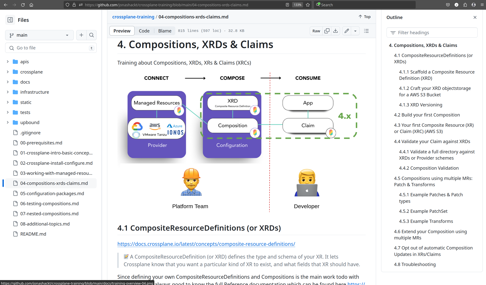

# crossplane-training
Crossplane training & hands-on workshop materials

This repo contains a training about [crossplane.io](https://www.crossplane.io/) and uses lecture & even more __hands-on tasks__ to introduce the __cloud native control plane framework__. This repo focusses on AWS, but can be easily adapted to other (cloud) computing vendors.

# Training overview

0. [Prerequisites ▶](00-prerequisites.md)
1. [Crossplane intro & basic concepts ▶](01-crossplane-intro-basic-concepts.md)
2. [Install & configure Crossplane & Providers ▶](02-crossplane-install-configure.md)
3. [Working with Managed Resources ▶](03-working-with-managed-resources.md)
4. [Compositions, XRDs & Claims ▶](04-compositions-xrds-claims.md)
5. [Managing Compositions: Configuration Packages ▶](05-configuration-packages.md)
6. [Testing Compositions ▶](06-testing-compositions.md)
7. [Nested Compositions ▶](07-nested-compositions.md)
8. [Additional Topics ▶](08-additional-topics.md)

# How to use this repository

The repo mixes content for learning and hand-on tasks. So be sure to always have everything from the [0. Prerequisites](00-prerequisites.md) prepared.

Then simply start with the section you want. It is adviced to start with `01` and go through the contents steps by step.

If you need inline navigation, use the "burger" menu in GitHub's top right corner:

Watch out for `> 📝 ` sections - they contain valuable information for your learning journey. But the most important part: have fun!